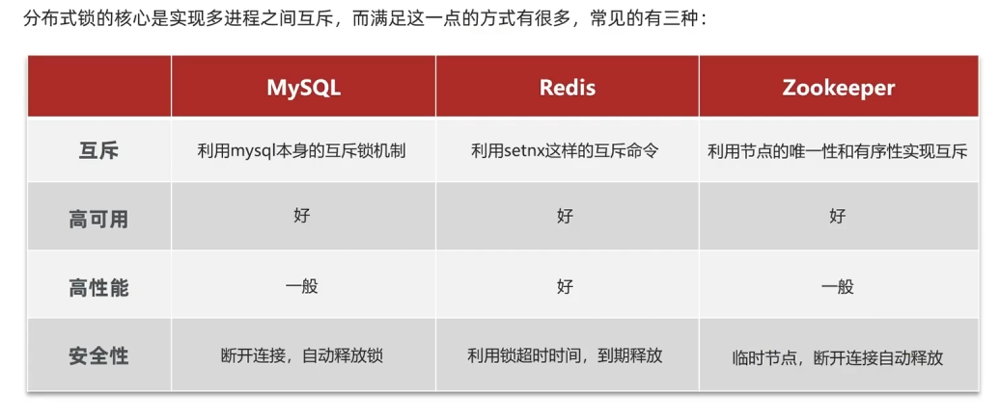

#
Remote directionary 
基于内存的数据库
性能高、支持数据持久化、主从复制、哨兵模式高可用特性

# 基础命令
启动服务 ```redis-server.exe```
停止服务 ```ctrl+c```

如果连接不上可以
`redis-cli shutdown`


需要在另一个终端输入以下命令
启动客户端 ```redis-cli```就可以使用redis命令了,也可以直接使用redisInsight
之后就不需要再输入`redis-cli`了
中文显示```redis-cli --raw```
```flushall```

查看ip `CONFIG GET bind`
查看端口 `CONFIG GET port`
查看服务是否开启`ping`如果返回 PONG，则表示服务正在运行；如果返回连接错误，说明服务未启动

## 设置数据
```set key value```
```get key```
```del key```
```exists key```
查找key```keys *```
清空key-value```flushall```
过期时间```TTL key``` 
设置过期时间```expire key time``` 
设置过期时间```setex key time value```
不存在时才设置```setnx key value```
## List
依次添加到头部
添加元素```lpush list elem```
删除元素```rpop list [num]```
显示元素```lrange list start stop```
查看长度```llen list```
只保留范围内的元素 ```ltram list start stop```
依次添加到尾部
```rpush list elem```
## set
不能重复元素
都以s开头
add ```sadd setname elem```
is Exist```sismember setname elem```
delete ```srem setname elem```
集合运算

## SortedSet
都以z开头，从小到大的顺序
add ```Add zadd setname score elem score elem```
show data```zrange setname start stop```
show score ```zscore setname elem```
rank```zrank setname elem```
reverse rank ```zrevrank setname elem```

## hash
h开头
```hset key field value```
```hget key field```
```hgetall key```
```hdel key field```
```hexists key field```
```hkeys key```
```hlen key```

# 高级命令
## 发布订阅模式
```publish channel message```
```subscribe channel```
消息无法持久化、无法记录历史消息
## Stream
x开头
```xadd channel * key value```
```xlen channel```
```xrange channel - +```
```xdel channel id```
```xtrim channel maxlen 0```


```xread count 2 block 1000 streams channel 0```
0表示重头开始读取 block后面是阻塞时长ms
```xread count 2 block 1000 streams channel $```
/$表示最新消息
消费者组
```xgroup create channel group1 0```
```xinfo groups channel```
```xgroup createconsumer channel groupname consumername```
```xread group groupname consumername count 2 block 3000 streams channel```

## geoSpacial
地理位置
```geoadd key 经度 纬度 member```
show pos```geopos key member```
distance ```geodist key member1 member2 [km]```
```geosearch key formmenber member byradius 200 km```

## hyperLogLog
```pfadd key value1 value2 ...```
```pfcount key```
合并2和3到1```pfmerge key1 key2 key3```

## bitMap
```setbit key offset value```
```getbit key offset```
偏移量对应一个值
统计值里面有多少位是1 ```bitcount key```
返回第一个出现bit的位置```bitpos key bit```

## bitfield
```bitfield key set u8 #0 1```
```bitfield key set u32 #1 100```
u8 means unsigned 8
```get key```-> 16进制

```bitfield key get u32 #1```

增加```bitfield key incrby u32 #1 100```

# 高级模式
## 事务
一次执行多个命令，并不能保证所有都能执行成功，不像sql
但是在exec之前都不会执行

```redis
multi

exec/discard

```

## 持久化
### RDB
适合用于备份
把目前Redis内存中数据，生成一个快照（RDB文件），保存在硬盘中
直接```save```
或者在redis.conf里进行修改模式
```bgsave```主进程不会被阻塞
###　AOF
AOF会以日志的形式记录每一个写操作
开启方式 appendonly no改成only

## 主从复制
一般来说主节点写 从节点读
查看 role
配置所属节点 ```replicaof host port```
```slaveof host port ```old
或者直接在配置文件里改成 主节点的host and port

## 哨兵模式
自动故障转移
以一个独立的进程
添加一个配置文件sentinel.conf
内容为：
    sentinel monitor master hots port 1
```redis-sentinel sentinel.conf```
一般会使用三个哨兵节点

# 

## jedis

需要引入Jedis依赖和测试Junit依赖

```java
package org.example.quick_start;

import org.junit.jupiter.api.AfterEach;
import org.junit.jupiter.api.BeforeEach;
import org.junit.jupiter.api.Test;
import redis.clients.jedis.Jedis;

public class JedisTest {
    private Jedis jedis;

    @BeforeEach
    void setUp() {
        // 建立连接
        jedis = new Jedis("127.0.0.0", 6379);
        // 设置密码
        jedis.auth("12345");
        // 选择库
        jedis.select(0);
    }
    @Test
    void testString(){
        String result = jedis.set("name","lxc");
        System.out.println("reslut"+ result);
        String name = jedis.get("name");
        System.out.println("name"+name);
    }
    @AfterEach
    void tearDown(){
        if(jedis != null){
            jedis.close();
        }
    }

}
```

## Jedis 线程池

## spring使用

1. 引入spring-boot-starter-data-redis依赖
```xml
        <dependencies>
        <!--redis依赖-->
        <dependency>
            <groupId>org.springframework.boot</groupId>
            <artifactId>spring-boot-starter-data-redis</artifactId>
        </dependency>
        <!--common-pool-->
        <dependency>
            <groupId>org.apache.commons</groupId>
            <artifactId>commons-pool2</artifactId>
        </dependency>
        <!--Jackson依赖-->
        <dependency>
            <groupId>com.fasterxml.jackson.core</groupId>
            <artifactId>jackson-databind</artifactId>
        </dependency>
        <dependency>
            <groupId>org.projectlombok</groupId>
            <artifactId>lombok</artifactId>
            <optional>true</optional>
        </dependency>
        <dependency>
            <groupId>org.springframework.boot</groupId>
            <artifactId>spring-boot-starter-test</artifactId>
            <scope>test</scope>
        </dependency>
        <dependency>
            <groupId>org.springframework.boot</groupId>
            <artifactId>spring-boot-starter-web</artifactId>
        </dependency>
    </dependencies>
```
2. 在application.yml配置redis信息
```yml
   spring:
  redis:
    host: 127.0.0.1
    port: 6379
    #    password: 123321
    lettuce:
      # 默认使用的是lettuce

      pool:
        max-active: 8
        max-idle: 8
        min-idle: 0
        max-wait: 100ms
```
3. 注入redisTemplate

```java
@SpringBootTest
class RedisDemoApplicationTests {
    @Autowired
    private RedisTemplate<String,Object> redisTemplate;
    @Test
    void testString() {
        // 写入一条String数据
        redisTemplate.opsForValue().set("name", "虎哥");
        // 获取string数据
        Object name = redisTemplate.opsForValue().get("name");
        System.out.println("name = " + name);
    }
    @Test
    void testSaveUser() {
        // 写入数据
        redisTemplate.opsForValue().set("user:100", new User("虎哥", 21));
        // 获取数据
        User o = (User) redisTemplate.opsForValue().get("user:100");
        System.out.println("o = " + o);
    }
}
```

# 黑马点评

## 登录
### 基于session
由于基于session，所以把验证码保存在session
#### 
```java
@Service
public class UserServiceImpl extends ServiceImpl<UserMapper, User> implements IUserService {

    @Resource
    private StringRedisTemplate stringRedisTemplate;

// 发送短信验证码
    @Override
    public Result sendCode(String phone, HttpSession session) {
        // 1.校验手机号
        if (RegexUtils.isPhoneInvalid(phone)) {
            // 2.如果不符合，返回错误信息
            return Result.fail("手机号格式错误！");
        }
        // 3.符合，生成验证码
        String code = RandomUtil.randomNumbers(6);
        // 4.保存验证码到 session
        session.setAttribute("code",code);
        // 5.发送验证码
        log.debug("发送短信验证码成功，验证码：{}", code);
        //没有真的发，只是模拟一下
        // 返回ok
        return Result.ok();
    }

//短信验证码登录、注册
    @Override
    public Result login(LoginFormDTO loginForm, HttpSession session) {
        // 1.校验手机号
        String phone = loginForm.getPhone();
        if (RegexUtils.isPhoneInvalid(phone)) {
            // 2.如果不符合，返回错误信息
            return Result.fail("手机号格式错误！");
        }
        // 3.从redis获取验证码并校验
       String cacheCode = session.getAttribute("code");
        //这种字符串最好放到一个固定的地方而不要这样写
        String code = loginForm.getCode();
        //前端提交的code
        if (cacheCode == null || !cacheCode.equals(code)) {
            //4. 不一致，报错
            return Result.fail("验证码错误");
        }
        //反向判断可以避免if-else嵌套

        // 4.一致，根据手机号查询用户 select * from tb_user where phone = ?
        User user = query().eq("phone", phone).one();
        // mybatisPlus
        // 因为继承了extends ServiceImpl<UserMapper, User>这是来自mybatisPlus
        // 这样就会去对应的表查询

        // 5.判断用户是否存在
        if (user == null) {
        // 6.不存在，创建新用户并保存
            user = createUserWithPhone(phone);
        }

        // 7.保存用户信息到 redis中
       session.setAttribute("user",user);
        // 存到session里的就不应该是完整的而应该是部分的信息
       session.setAttribute("user",BeanUtil.copyProperties(user,UserDTO.class));
        // 这样登录以后存进去的就是UserDTO

        //以上2选1

        // 8.返回token
        return Result.ok();
    }

//注册
    private User createUserWithPhone(String phone) {
        // 1.创建用户
        User user = new User();
        user.setPhone(phone);
        user.setNickName(USER_NICK_NAME_PREFIX + RandomUtil.randomString(10));
        // 2.保存用户
        save(user);
        return user;
    }

}
```
服务端通常基于 Cookie 中携带的会话标识（一般是一个唯一的 ID）来获取对应的 Session 信息。
可能会由于多个TomCat导致切换的时候，session信息不同步问题

#### 登录拦截器
```java
public class LoginInterceptor implements HandlerInterceptor {

    @Override
    public boolean preHandle(HttpServletRequest request, HttpServletResponse response, Object handler) throws Exception {
        // 1. 获取session
        HttpSession session = request.getSession();

        // 2. 获取session中的用户
        Object user = session.getAttribute("user");

        // 3. 判断用户是否存在
        if (user == null) {
            // 没有，需要拦截，设置状态码
            response.setStatus(401);
            // 拦截
            return false;
        }
        // 有用户，则放行
        return true;
    }
}
```
当然还需要添加拦截器
```java
@Configuration
public class MvcConfig implements WebMvcConfigurer {

    @Resource
    private StringRedisTemplate stringRedisTemplate;

    @Override
    public void addInterceptors(InterceptorRegistry registry) {
        // 登录拦截器
        registry.addInterceptor(new LoginInterceptor())
                .excludePathPatterns(
                        "/shop/**",
                        "/voucher/**",
                        "/shop-type/**",
                        "/upload/**",
                        "/blog/hot",
                        "/user/code",
                        "/user/login"
                );
    }
}
```
1. 权限验证
在处理用户请求之前，拦截器可以检查用户是否具有访问该资源的权限。例如，对于一些需要登录才能访问的页面或接口，拦截器可以检查用户的会话（Session）或令牌（Token）是否有效。如果用户未登录或权限不足，拦截器可以直接返回错误信息，阻止请求继续传递到目标处理程序。
### 基于Redis实现共享session
#### 
```java
    @Override
    public Result sendCode(String phone, HttpSession session) {
        // 1.校验手机号
        if (RegexUtils.isPhoneInvalid(phone)) {
            // 2.如果不符合，返回错误信息
            return Result.fail("手机号格式错误！");
        }
        // 3.符合，生成验证码
        String code = RandomUtil.randomNumbers(6);

        // 4.保存验证码到 session
        stringRedisTemplate.opsForValue().set(LOGIN_CODE_KEY + phone, code, LOGIN_CODE_TTL, TimeUnit.MINUTES);

        // 5.发送验证码
        log.debug("发送短信验证码成功，验证码：{}", code);
        //没有真的发，只是模拟一下
        // 返回ok
        return Result.ok();
    }

    @Override
    public Result login(LoginFormDTO loginForm, HttpSession session) {
        // 1.校验手机号
        String phone = loginForm.getPhone();
        if (RegexUtils.isPhoneInvalid(phone)) {
            // 2.如果不符合，返回错误信息
            return Result.fail("手机号格式错误！");
        }
        // 3.从redis获取验证码并校验
        String cacheCode = stringRedisTemplate.opsForValue().get(LOGIN_CODE_KEY + phone);
//        String cacheCode = session.getAttribute("code");
        //这种字符串最好放到一个固定的地方而不要这样写
        String code = loginForm.getCode();
        //前端提交的code
        if (cacheCode == null || !cacheCode.equals(code)) {
            // 不一致，报错
            return Result.fail("验证码错误");
        }
        //反向判断可以避免if-else嵌套

        // 4.一致，根据手机号查询用户 select * from tb_user where phone = ?
        User user = query().eq("phone", phone).one();
        // mybatisPlus
        // 因为继承了extends ServiceImpl<UserMapper, User>这是来自mybatisPlus
        // 这样就会去对应的表查询

        // 5.判断用户是否存在
        if (user == null) {
            // 6.不存在，创建新用户并保存
            user = createUserWithPhone(phone);
        }

        // 7.保存用户信息到 redis中
        // 7.1.随机生成token，作为登录令牌
        String token = UUID.randomUUID().toString(true);
        // 7.2.将User对象转为HashMap存储
        UserDTO userDTO = BeanUtil.copyProperties(user, UserDTO.class);
        Map<String, Object> userMap = BeanUtil.beanToMap(userDTO, new HashMap<>(),
                CopyOptions.create()
                        .setIgnoreNullValue(true)
                        .setFieldValueEditor((fieldName, fieldValue) -> fieldValue.toString()));
        // 7.3.存储
        String tokenKey = LOGIN_USER_KEY + token;
        stringRedisTemplate.opsForHash().putAll(tokenKey, userMap);
        // 7.4.设置token有效期
        stringRedisTemplate.expire(tokenKey, LOGIN_USER_TTL, TimeUnit.MINUTES);

        // 8.返回token
        return Result.ok(token);
        //这里的token会被前端保存在sessionStrage里
        //axios拦截器会把这个token携带
    }

    private User createUserWithPhone(String phone) {
        // 1.创建用户
        User user = new User();
        user.setPhone(phone);
        user.setNickName(USER_NICK_NAME_PREFIX + RandomUtil.randomString(10));
        // 2.保存用户
        save(user);
        return user;
    }
```
#### 刷新拦截器
```java
ublic class LoginInterceptor implements HandlerInterceptor {

    @Override
    public boolean preHandle(HttpServletRequest request, HttpServletResponse response, Object handler) throws Exception {
        // 1.判断是否需要拦截（ThreadLocal中是否有用户）
        if (UserHolder.getUser() == null) {
            // 没有，需要拦截，设置状态码
            response.setStatus(401);
            // 拦截
            return false;
        }
        // 有用户，则放行
        return true;
    }
}
```

登录拦截器就不需要这么复杂了，只需要判断是否登录

```java
public class RefreshTokenInterceptor implements HandlerInterceptor {

    private StringRedisTemplate stringRedisTemplate;

    public RefreshTokenInterceptor(StringRedisTemplate stringRedisTemplate) {
        this.stringRedisTemplate = stringRedisTemplate;
    }

    @Override
    public boolean preHandle(HttpServletRequest request, HttpServletResponse response, Object handler) throws Exception {
        // 1.获取请求头中的token
        String token = request.getHeader("authorization");
        if (StrUtil.isBlank(token)) {
            return true;
        }
        // 2.基于TOKEN获取redis中的用户
        String key  = LOGIN_USER_KEY + token;
        Map<Object, Object> userMap = stringRedisTemplate.opsForHash().entries(key);
        // 3.判断用户是否存在
        if (userMap.isEmpty()) {
            return true;
        }
        // 5.将查询到的hash数据转为UserDTO
        UserDTO userDTO = BeanUtil.fillBeanWithMap(userMap, new UserDTO(), false);
        // 6.存在，保存用户信息到 ThreadLocal
        UserHolder.saveUser(userDTO);
        // 7.刷新token有效期
        stringRedisTemplate.expire(key, LOGIN_USER_TTL, TimeUnit.MINUTES);
        // 8.放行
        return true;
    }

    @Override
    public void afterCompletion(HttpServletRequest request, HttpServletResponse response, Object handler, Exception ex) throws Exception {
        // 移除用户
        UserHolder.removeUser();
    }
}
```

当然还需要添加拦截器
```java
@Configuration
public class MvcConfig implements WebMvcConfigurer {

    @Resource
    private StringRedisTemplate stringRedisTemplate;

    @Override
    public void addInterceptors(InterceptorRegistry registry) {
        // 登录拦截器
        registry.addInterceptor(new LoginInterceptor())
                .excludePathPatterns(
                        "/shop/**",
                        "/voucher/**",
                        "/shop-type/**",
                        "/upload/**",
                        "/blog/hot",
                        "/user/code",
                        "/user/login"
                ).order(1);
        // token刷新的拦截器
        registry.addInterceptor(new RefreshTokenInterceptor(stringRedisTemplate)).addPathPatterns("/**").order(0);
        // 拦截所有路径
    }
}
```
## 缓存
### 基本用法
查询操作
```java
    @Override
    public Result queryById(Long id) {
        String key = CACHE_SHOP_KEY +id;
        // 从redis中查询商铺缓存
        String shopJson = stringRedisTemplate.opsForValue().get(key);
        // 判断是否存在
        if (StrUtil.isNotBlank(shopJson)){
            // 存在则直接返回
            Shop shop =JSONUtil.toBean(shopJson, Shop.class);
            return Result.ok(shop);
        }
        // 不存在则数据库中查
        Shop shop = getById(id);
        // 如果不存在则查询失败
        if(shop == null){
            return Result.fail("shop is not existing");
        }
        // 如果查询到了需要存在redis中
        StringRedisTemplate.opsForValue().set(key, JSONUtil.toJsonStr(shop), 30L, TimeUnit.MINUTES);
        // 返回
        return Result.ok(shop);
    }
```

更新操作
```java
    @Override
    @Transactional
    //事务
    public Result update(Shop shop) {
        Long id = shop.getId();
        if (id == null) {
            return Result.fail("店铺id不能为空");
        }
        // 1.更新数据库
        updateById(shop);
        // 2.删除缓存
        stringRedisTemplate.delete(CACHE_SHOP_KEY + id);
        return Result.ok();
    }
```
### 缓存穿透
永远不会生效的，请求的数据不存在
1. 缓存空对象
    直接存一个null
    优点：实现简单
    缺点：额外的内存消耗——设置一个TTL
    缺点：可能造成短期的不一致
2. 布隆过滤
   在进去redis之间添加一个布隆过滤器，判断数据是否存在
   客户端--布隆过滤器--redis--数据库
   bit数组
   优点：内存占用少
   缺点：实现复杂
   缺点：存在误判可能

   查询操作
```java
    @Override
    public Result queryById(Long id) {
        String key = CACHE_SHOP_KEY +id;
        String shopJson = stringRedisTemplate.opsForValue().get(key);
        if (StrUtil.isNotBlank(shopJson)){
            //只有里面是真的字符串的时候才是true，null/""/\t\n都是false
            Shop shop =JSONUtil.toBean(shopJson, Shop.class);
            return Result.ok(shop);
        }
        //命中的是否是""
        if(shopJson != null){
            return Result.fail("shop is not existing");
        }
        Shop shop = getById(id);
        if(shop == null){
            //如果数据库中不存在，则将空值写入redis
            StringRedisTemplate.opsForValue().set(key, "", CASHE_NULL_TTL, TimeUnit.MINUTES);
            return Result.fail("shop is not existing");
        }
        StringRedisTemplate.opsForValue().set(key, JSONUtil.toJsonStr(shop), 30L, TimeUnit.MINUTES);
        return Result.ok(shop);
    }
```
### 缓存雪崩
1. 许多缓存失效
    给不同的key的TTL添加随机值
2. redis宕机
    利用redis集群提高服务的可用性——哨兵主从
给缓存业务添加降级限流策略——SpringCloud
给业务添加多级缓存
### 缓存击穿
高并发访问并且缓存重建业务复杂，可能要多个表中查询并且要计算。
1. 互斥锁
    未命中的时候，获取互斥锁，然后查询数据库重建缓存数据，写入缓存再释放锁。
2. 逻辑过期
    只需要判断逻辑上是否过期，设置一个逻辑过期时间
    获取锁之后开一个新的线程重新获取再释放锁
    那么原来的线程**返回过期数据**就行

#### 互斥锁
获取锁和释放锁
```java
private boolean tryLock(String key){
    Booblean flag = StringRedisTemplate.opsForValue().setIfAbsent(key,"1",10,TimeUnit.SECOND);
    return BooleanUtil.isTrue(flag);
}

private void unlock(String key){
    StringRedisTemplate.delete(key);
}
```
互斥锁的代码
```java
// 解决缓存穿透
public Shop queryWithPassThough(Long id) {
...
    }
//互斥锁
public Shop queryWithMutex(Long id) {
        String key = CACHE_SHOP_KEY +id;
        String shopJson = stringRedisTemplate.opsForValue().get(key);
        if (StrUtil.isNotBlank(shopJson)){
            return JSONUtil.toBean(shopJson, Shop.class);
        }
        if(shopJson != null){
            return null;
        }
        //未命中的情况下就要去获取空值锁
        //实现缓存重建
        //4.1 获取互斥锁
        String lockKey = "lock:shop:"+id;
        try{boolean isLock = tryLock(lockKey);
        //4.2 判断是否获取成功
        if(!isLock){
            Thread.sleep(50);
            return queryWithMutex(id);
        }
        Shop shop = getById(id);

        if(shop == null){
            StringRedisTemplate.opsForValue().set(key, "", CASHE_NULL_TTL, TimeUnit.MINUTES);
            return null;
        }
        StringRedisTemplate.opsForValue().set(key, JSONUtil.toJsonStr(shop), 30L, TimeUnit.MINUTES);
        }
        
        catch(InterruptedException e) {
            throw new RuntimeException(e)
        }finally{
        //4.3 释放互斥锁
        unlock(lockKey);}
        return shop;
    }

@override
public Result queryById(Long id){
    // 解决缓存穿透
    // Shop shop = queryWithPassThough(id);

    // 互斥锁解决缓存击穿
    Shop shop = queryWithMutex(id);
    if(shop == null){
        return Result.fail("is not existing");
    }

    return Result.ok(shop);
}
```

#### 逻辑过期
要添加一个逻辑过期时间属性
```java
@Data
public class RedisData{
    private localDateTime expireTime;
    private Object data;
}
```
缓存预热
```java
private void saveShop2Redis(Long id){
    // 1. 查询店铺数据
    Shop shop = getById(id);
    // 2. 封装逻辑过期时间
    RedisData redisData = new RedisData();
    redisData.setData(shop);
    redisData.setExpireTime(LocalDataTime.now().plusSeconds(expireSeconds));
    // 3. 写入redis

}
```
无论如何都返回数据，只有当过期且无锁时，更新过期时间。
```java
//线程池
private static final ExecutorService CACHE_REBUILD_EXECUTOR = Executors.newFixedThreadPool(10);

public Shop queryWithLogicExpire(Long id) {
    String key = CACHE_SHOP_KEY +id;
    String shopJson = stringRedisTemplate.opsForValue().get(key);
    //不存在直接返回null
    if (StrUtil.isBlank(shopJson)){
        return null;
    }

    //命中，需要先把json反序列化为对象
    RedisData redisData = JSONUtil.toBean(shopJson,RedisData.class);
    JsonObject data = (JsonObject) redisData.getData();
    Shop shop = JSONUtil.toBean(data, Shop.class);
    LocalDateTime expireTime = redisData.getExpireTime();
    //判断是否过期
    if(expireTime.isAfter(LocalDateTime.now())){
        //未过期
        return shop;
    }
    
    //过期,获取互斥锁
    String lockKey = LOCK_SHOP_KEY + id;
    boolean isLock = tryLock(lockKey);
    //判断是否获取成功
    if(isLock){
        CACHE_REBUILD_EXECUTOR.submit(()->{
            try{
                //开启独立线程实现缓存重建
                this.saveShop2Redis(id,20L);
            }catch(Exception e){
                throw new RuntimeException(e);
            }finally{
                unlock(lockKey);
            } 
        })
        

    }
    //返回过期的店铺信息
    return shop;
}

@override
public Result queryById(Long id){
    Shop shop = queryWithLogicExpire(id);
    if(shop == null){
        return Result.fail("is not existing");
    }

    return Result.ok(shop);
}
```
### 缓存工具封装
存储数据到redis
逻辑过期时间存到redis中
查redis，并反序列化，空对象解决缓存穿透
查redis，并反序列化，逻辑过期解决缓存击穿
## 秒杀
### 全局唯一id
唯一性 高可用 高性能 递增性 安全性
符号位1 时间戳31 序列号32
UUID Redis自增 snowflake算法 数据库自增
#### redis自增
```java
@Component
public class RedisIdWorker{
    private static final long BEGIN_TIMESTAMP ;
    private static final int COUNT_BITS = 32;

    private StringRedisTemplate stringRedisTemplate;
    public long nextId(String keyPrefix){
        //1.生成时间戳
        LocalDataTime now = LocalDataTime.now();
        long nowSecond = now.toEpochSecond(ZoneOffset.UTC);
        long timeStamp = nowSecond -BEGIN_TIMESTAMP;

        //2.生成序列号，每一天下的单采用一个序列号
        //获取日期
        String date = now.format(DateTimeFormatter.ofPattern("yyyyMMdd"));
        long count = stringRedisTemplate.opsForValue().increment("icr:" + keyPrefix + ":" + date)

        //3.拼接
        return timeStamp << COUNT_BITS | count;
    }
}
```
### 优惠券添加
会添加到voucher和seckill_voucher表里，voucher表里有普通优惠券和秒杀优惠券，而seckill_voucher是秒杀优惠券的扩展表
### 优惠券下单
下单以后回加入到订单表里
```java
@Resource
private ISeckillVoucherService seckillVoucherService;
@Transactional
public Result seckillVoucher(Long voucherId){
    // 查询优惠券
    SeckillVoucher voucher = seckillVoucherService.getById(voucherId);
    // 秒杀是否开始或结束
    if(voucher.getBeginTime().isAfter(LocalDateTime.now())){
        //尚未开始
        return Result.fail();
    }
    if(voucher.getEndTime().isBefore(LocalDateTime.now())){
        //已经结束
        return Result.fail();
    }

    // 库存是否充足
    if(voucher.getStock <1){
        //库存不足
        return Result.fail();
    }

    //扣减库存
    boolean success = seckillVoucherService.update().setsql("stock = stock-1").eq("voucher_id", voucherId).update();
    if(!success){
        return Result.fail();
    }

    //创建订单
    VoucherOrder voucherOrder = new VoucherOrder();
    //设置订单id用户id代金券id
    save(voucherOrder);
    return Result.ok(voucherOrderId);

}
```
### 超卖问题
#### 悲观锁
确保线程串行执行
Synchronized、Lock
#### 乐观锁
版本号判断是否被修改，每次修改数据版本+1

CAS法
```java
//扣减库存
    boolean success = seckillVoucherService.update()
    .setsql("stock = stock-1")
    .eq("voucher_id", voucherId).eq("stock",voucher.getstock())//where条件
    .update();
```
但是这样失败率会增加
```java
//扣减库存
    boolean success = seckillVoucherService.update()
    .setsql("stock = stock-1")
    .eq("voucher_id", voucherId).gt("stock",0)//where条件stock>0
    .update();
```
### 一人一单
库存充足以后，还需要查询订单是否已存在，存在就返回异常就可以了
```java
int count =query().eq("user_id", userId).eq("voucher_id", voucherId).count();

if(count>0){
    return Result.fail();
}
```
上述的代码，如果在第一次创建的时候有多个线程，那就会有问题
```java
Long userId = UserHolder.getUser().getId();
synchronized(userId.tostring().intern()){
    //需要拿到事务代理的对象，不然下述的函数事务会失效
    IVourcherOrderService proxy = (IVourcherOrderService)AopContext.currentProxy();
    return proxy.createVoucherOrder(voucherId);
    }
```
这样做还需要添加依赖`aspectjweaver`
启动项还需要添加注解`@EnableAspectJAutoProxy(exposeProxy =true)`
```java
@Transactional
createVoucherOrder{
    // 判断订单是否存在

    // 扣减库存

    // 创建订单

    // 返回订单id
}
```
### 秒杀优化
由于tomcat中的流程太长，而且每个步骤都需要访问数据库。
购买资格 和 减库存下单 分为两部分
将购买资格的内容放在redis里，然后保存必要信息到一个阻塞队列里，然后tomcat再异步地读取队列中的信息，完成下单。

防止超卖：键值对
一人一单：set集合
1. 新增秒杀优惠券的同时，将优惠券信息保存到Redis中
2. 基于Lua脚本，判断秒杀库存、一人一单，决定用户是否抢购成功
3. 如果抢购成功，将优惠券id和用户id封装后存入阻塞队列
4. 开启线程任务，不断从阻塞队列中获取信息，实现异步下单功能

#### 1.
```java
    @Override
    @Transactional
    public void addSeckillVoucher(Voucher voucher) {
        // 保存优惠券
        save(voucher);
...保存秒杀信息
        // 保存秒杀库存到Redis中
        stringRedisTemplate.opsForValue().set(SECKILL_STOCK_KEY + voucher.getId(), voucher.getStock().toString());
    }
```
#### 2.
lua脚本
```lua
-- 1.参数列表
-- 1.1.优惠券id
local voucherId = ARGV[1]
-- 1.2.用户id
local userId = ARGV[2]
-- 1.3.订单id
local orderId = ARGV[3]

-- 2.数据key
-- 2.1.库存key
local stockKey = 'seckill:stock:' .. voucherId
-- 2.2.订单key
local orderKey = 'seckill:order:' .. voucherId

-- 3.脚本业务
-- 3.1.判断库存是否充足 get stockKey
if(tonumber(redis.call('get', stockKey)) <= 0) then
    -- 3.2.库存不足，返回1
    return 1
end
-- 3.2.判断用户是否下单 SISMEMBER orderKey userId 存在==1 不存在==0
if(redis.call('sismember', orderKey, userId) == 1) then
    -- 3.3.存在，说明是重复下单，返回2
    return 2
end
-- 3.4.扣库存 incrby stockKey -1
redis.call('incrby', stockKey, -1)
-- 3.5.下单（保存用户）sadd orderKey userId
redis.call('sadd', orderKey, userId)
return 0
```
购买资格判断
```java
public Result seckillVoucher(Long voucherId) {
    Long userId = UserHolder.getUser().getId();
    long orderId = redisIdWorker.nextId("order");
    // 1.执行lua脚本
    Long result = stringRedisTemplate.execute(
            SECKILL_SCRIPT,
            Collections.emptyList(),
            voucherId.toString(), userId.toString(), String.valueOf(orderId)
    );
    int r = result.intValue();
    // 2.判断结果是否为0
    if (r != 0) {
        // 2.1.不为0 ，代表没有购买资格
        return Result.fail(r == 1 ? "库存不足" : "不能重复下单");
    }

    //todo 保存至消息队列，在第三步会加入其中

    // 3.返回订单id
    return Result.ok(orderId);
}
```

#### 3.
```java
// 2.2.为0 ，有购买资格，把下单信息保存到阻塞队列
VoucherOrder voucherOrder = new VoucherOrder();
// 2.3.订单id
long orderId = redisIdWorker.nextId("order");
voucherOrder.setId(orderId);
// 2.4.用户id
voucherOrder.setUserId(userId);
// 2.5.代金券id
voucherOrder.setVoucherId(voucherId);
// 2.6.放入阻塞队列
orderTasks.add(voucherOrder);
```
阻塞队列，如果没人下单就会阻塞，如果有人下单就会唤醒
```java
private BlockingQueue<VoucherOrder> orderTasks = new ArrayBlockingQueue<>(1024 * 1024);
```
#### 4.
```java
private class VoucherOrderHandler implements Runnable{
    @Override
    public void run() {
        while (true){
            try {
                // 1.获取队列中的订单信息
                VoucherOrder voucherOrder = orderTasks.take();
                // 2.创建订单
                createVoucherOrder(voucherOrder);
            } catch (Exception e) {
                log.error("处理订单异常", e);
            }
        }
    }
}
```
## 分布式锁
集群模式下synchronized会失效
多进程可见 互斥 高可用 高性能 安全性
基于mysql 基于redis 基于zookeeper

获取锁
`set lock thread1 ex 10 nx`
释放锁
`del lock`
### 初级版
```java
public interface ILock{
    boolean tryLock(long timeoutSec);
    void unlock();
}
```
```java
public class simpleRedisLock implements ILock{
    private String name;
    private StringRedisTemplate stringRedisTemplate;

    public simpleRedisLock(String name, StringRedisTemplate stringRedisTemplate){
        this.name = name;
        this.stringRedisTemplate=stringRedisTemplate;
        }

    private static final string KEY_PREFIX = "lock:"
    private boolean tryLock(long timeoutSec){
        //获取线程的id作为值
        long threadId = Thread.currentThread().getId();
        Booblean success = StringRedisTemplate.opsForValue().setIfAbsent(KEY_PREFIX+name,threadId+"",timeoutSec,TimeUnit.SECONDS);
        return Boolean.TRUE.equals(success);//避免空指针的可能性
}

    private void unlock(String key){
        StringRedisTemplate.delete(key);
    }
}
```
创建锁对象
```java
Long userId = UserHolder.getUser().getId();
SimpleRedisLock lock = new SimpleRedisLock("order:"+userId, stringRedisTemplate);
Boolean isLock = lock.tryLock(锁时间);
//判断获取锁成功
if(!isLock){
    //获取锁不成功
    return Result.fail();
}

try{
        //获取锁成功
    IVourcherOrderService proxy = (IVourcherOrderService)AopContext.currentProxy();
    return proxy.createVoucherOrder(voucherId);
}finally{
    lock.unlock();
}
```
### 误删问题
业务阻塞导致锁提前释放，但是阻塞结束又删了别的线程的锁，导致新的线程又能拿到锁。
所以在释放锁的时候，判断锁的标识是否一致。

uuid是用来区分不同的jvm的，而线程id是区分同一个jvm里的不同的线程的。
```java
public class simpleRedisLock implements ILock{
    private String name;
    private StringRedisTemplate stringRedisTemplate;
    private static final String ID_PREFIX = UUID.randomUUID().toString(true)+"-";
    public simpleRedisLock(String name, StringRedisTemplate stringRedisTemplate){
        this.name = name;
        this.stringRedisTemplate=stringRedisTemplate;
        }

    private static final string KEY_PREFIX = "lock:"
    private boolean tryLock(long timeoutSec){
        //获取线程的id作为值
        String threadId = ID_PREFIX + Thread.currentThread().getId();
        Booblean success = StringRedisTemplate.opsForValue().setIfAbsent(KEY_PREFIX+name,threadId,timeoutSec,TimeUnit.SECONDS);
        return Boolean.TRUE.equals(success);//避免空指针的可能性
}

    private void unlock(){
        // 获取线程标识
        String threadId = ID_PREFIX + Thread.currentThread().getId();
        //获取锁中的标示
        String id = stringRedisTemplate.opsForValue().get(KEY_PREFIX + name);
        // 判断标示是否一致
        if(threadId.equals(id)){
        StringRedisTemplate.delete(KEY_PREFIX + name);
        }
    }
}
```
### 原子问题
unlock可能判断一致，但还没来得及释放
使用lua脚本（针对redis）
```lua
-- 比较线程标示与锁中的标示是否一致
if(redis.call('get', KEYS[1]) ==  ARGV[1]) then
    -- 释放锁 del key
    return redis.call('del', KEYS[1])
end
return 0
```
```java
    private static final String KEY_PREFIX = "lock:";
    private static final String ID_PREFIX = UUID.randomUUID().toString(true) + "-";
    private static final DefaultRedisScript<Long> UNLOCK_SCRIPT;
    static {
        UNLOCK_SCRIPT = new DefaultRedisScript<>();
        UNLOCK_SCRIPT.setLocation(new ClassPathResource("unlock.lua"));
        UNLOCK_SCRIPT.setResultType(Long.class);
    }

    @Override
    public void unlock() {
        // 调用lua脚本
        stringRedisTemplate.execute(
            UNLOCK_SCRIPT,
            Collections.singletonList(KEY_PREFIX + name),
            ID_PREFIX + Thread.currentThread().getId());
    }
```
### redisson
之前可能会有的问题
    不可重入性：之前的锁，同一个线程无法多次获取同一把锁
    不可重试：只尝试一次就返回false，没有重试机制
    超时释放：会导致安全问题
    主从一致性：尚未同步锁，就会有安全问题
#### 入门
引入依赖:
```xml
<dependency>
    <groupId>org.redisson</groupId>
    <artifactId>redisson</artifactId>
    <version>3.13.6</version>
</dependency>
```
配置Redisson客户端:
```java
@Configuration
public class RedisConfig{
@Bean
    public RedissonClient redissonclient(){
        // 配置类
        Config config =new Config();
        //添加redis地址，这里添加了单点的地址，也可以使用config.useClusterServers()添加集群地址
        config.useSingleServer().setAddress("redis://192.168.150.101:6379").setPassowrd("123321");
        // 创建客户端
    return Redisson.create(config);
    }
}
```
使用Redisson的分布式锁
```java
@Resource
private RedissonClient redissonClient;
@Test
void testRedisson()throws InterruptedException {
    // 获取锁(可重入)，指定锁的名称
    RLock lock=redissonClient.getLock("anyLock");
    // 尝试获取锁，参数分别是:获取锁的最大等待时间(期间会重试)，锁自动释放时间，时间单位
    boolean isLock =lock.tryLock(1,10,TimeUnit.SECONDS);
    // 判断释放获取成功
    if(isLock){
        try {
            System.out.println("执行业务");}
        finally {//释放锁
            lock.unlock();}
    }
}
```

```java
private void createVoucherOrder(VoucherOrder voucherOrder) {
    Long userId = voucherOrder.getUserId();
    Long voucherId = voucherOrder.getVoucherId();
    // 创建锁对象
    RLock redisLock = redissonClient.getLock("lock:order:" + userId);
    // 尝试获取锁
    boolean isLock = redisLock.tryLock();
    // 判断
    if (!isLock) {
        // 获取锁失败，直接返回失败或者重试
        log.error("不允许重复下单！");
        return;
    }

    try {
        ...业务逻辑
    } finally {
        // 释放锁
        redisLock.unlock();
    }
}
```
#### 原理

不可重入性：
    同一个线程进入同一个锁，key，value（field thread，value 1）
    进入一次state++
    退出一次state--
不可重试：等待重试机制——订阅者模式
    传入等待时间参数。Redisson 会在指定的等待时间内不断尝试获取锁，每次尝试失败后会等待一段时间再进行下一次尝试。
超时释放：看门狗机制。
    Redisson 在获取锁时，会启动一个定时任务（看门狗机制），定期检查锁是否还被当前线程持有，如果是，则自动延长锁的过期时间。默认情况下，看门狗的检查周期是 30 秒，锁的初始过期时间也是 30 秒。
主从一致性：向多个节点获取锁：multiLock

## 消息队列
Message Queue
生产者 消息队列（message broker） 消费者
Redis提供了三种不同的方式来实现消息队列:
   - list结构:基于List结构模拟消息队列
   - PubSub:基本的点对点消息模型
   - Stream:比较完善的消息队列模型
  
### List
消费者等待`BRpop keylist time`
生产者生产`LPush keylist value`
基于List的消息队列有哪些优缺点?
优点:
    利用Redis存储，不受限于JVM内存上限
    基于Redis的持久化机制，数据安全性有保证
    可以满足消息有序性
缺点:
    无法避免消息丢失
    只支持单消费者
### PubSub 发布订阅
Pubsub(发布订阅)是Redis2.0版本引入的消息传递模型。顾名思义，消费者可以订阅一个或多个channel，生产者向对应channel发送消息后，所有订阅者都能收到相关消息。
`SUBSCRIBE channel[channel]`:订阅一个或多个频道
`PUBLISH channel msg` :向一个频道发送消息
`PSUBSCRIBE pattern[pattern]`:订阅与pattern格式匹配的所有频道

消费者等待
`SUBSCRIBE order.q1`
`SUBSCRIBE order.*`
`SUBSCRIBE order.q[ab]`
`SUBSCRIBE order.q?`

生产者生产
`PUBLISH order.q1 hello`

基于Pubsub的消息队列有哪些优缺点?
优点:
    采用发布订阅模型，支持多生产、多消费
缺点:
    不支持数据持久化
    无法避免消息丢失
    消息堆积有上限，超出时数据丢失

### Stream
是一种数据类型，支持数据持久化
生产者 `xadd key *|time entries`
`xadd s1 * name jack age 21`

消费者 
`xread count 1 streams s1 0`从0开始读，读1条
`xread count 1 streams s1 $`最新消息
`xread count 1 block 0 streams s1 $`阻塞读取

STREAM类型消息队列的XREAD命令特点:
  - 消息可回溯
  - 一个消息可以被多个消费者读取
  - 可以阻塞读取
  - 有消息漏读的风险

#### 消费者组
消息分流——而非重复消费
消息标示——记录最后一个被处理的消息
消息确认——pending，可以解决消息丢失问题
创建消费者组
`Xgroup create key groupname ID [MKSTREAM]`
  - key:队列名称
  - groupName:消费者组名称
  - ID:起始ID标示，$代表队列中最后一个消息，0则代表队列中第一个消息
  - MKSTREAM:队列不- 存在时自动创建队列
删除指定的消费者组
`XGROUP DESTORY key groupName`
给指定的消费者组添加消费者
`XGROUP CREATECONSUMER key groupname consumername`
删除消费者组中的指定消费者
`XGROUP DELCONSUMER key groupname consumername`

从消费者组读取消息
`XREADGROUP GROUP group consumer [COUNT count] [BLOCK millisecondS] [NOACK] STREAMS key ID`
- group:消费组名称
- consumer:消费者名称，如果消费者不存在，会自动创建一个消费者
- count:本次查询的最大数量
- BLOCK milliseconds:当没有消息时最长等待时间
- NOACK:无需手动ACK，获取到消息后自动确认
- STREAMS key:指定队列名称
- 获取消息的起始ID:ID:
- ">":从下一个未消费的消息开始
- 其它:根据指定id从pending-list中获取已消费但未确认的消息，例如0，是从pending-list中的第一个消息开始

`XREADGROUP GROUP g1 c1 COUNT 1 BLOCK 200 STREAMS s1 >`

确认消息
`XACK key group id`

查看pending list
`XPENDING key group [[lDLE min-idle-time] start end count [consumer]]`


STREAM类型消息队列的XREADGROUP命令特点:
- 消息可回溯
- 可以多消费者争抢消息，加快消费速度
- 可以阻塞读取
- 没有消息漏读的风险
- 有消息确认机制，保证消息至少被消费一次

### 基于Redis的Stream结构作为消息队列，实现异步秒杀下单
需求:
1. 创建一个Stream类型的消息队列，名为stream.orders
```lua   
XGROUP CREATE stream.orders g1 0 MKSTREAM
```
2. 修改之前的秒杀下单Lua脚本，在认定有抢购资格后，直接向stream.orders中添加消息，内容包含voucherld、userld、orderld
```lua
-- 3.5.下单（保存用户）sadd orderKey userId
redis.call('sadd', orderKey, userId)
-- 3.6.发送消息到队列中， XADD stream.orders * k1 v1 k2 v2 ...
redis.call('xadd', 'stream.orders', '*', 'userId', userId, 'voucherId', voucherId, 'id', orderId)
```
启动了lua脚本，消息就会发送到队列，就不需要在Java里写了
```java
    @Override
    public Result seckillVoucher(Long voucherId) {
        Long userId = UserHolder.getUser().getId();
        long orderId = redisIdWorker.nextId("order");
        // 1.执行lua脚本
        Long result = stringRedisTemplate.execute(
                SECKILL_SCRIPT,
                Collections.emptyList(),
                voucherId.toString(), userId.toString(), String.valueOf(orderId)
        );
        int r = result.intValue();
        // 2.判断结果是否为0
        if (r != 0) {
            // 2.1.不为0 ，代表没有购买资格
            return Result.fail(r == 1 ? "库存不足" : "不能重复下单");
        }
        // 3.返回订单id
        return Result.ok(orderId);
    }
```
3. 项目启动时，开启一个线程任务，尝试获取stream.orders中的消息，完成下单
```java
private class VoucherOrderHandler implements Runnable {

    @Override
    public void run() {
        while (true) {
            try {
                // 1.获取消息队列中的订单信息 XREADGROUP GROUP g1 c1 COUNT 1 BLOCK 2000 STREAMS s1 >
                List<MapRecord<String, Object, Object>> list = stringRedisTemplate.opsForStream().read(
                        Consumer.from("g1", "c1"),
                        StreamReadOptions.empty().count(1).block(Duration.ofSeconds(2)),
                        StreamOffset.create("stream.orders", ReadOffset.lastConsumed())
                );
                // 2.判断订单信息是否为空
                if (list == null || list.isEmpty()) {
                    // 如果为null，说明没有消息，继续下一次循环
                    continue;
                }
                // 解析数据
                MapRecord<String, Object, Object> record = list.get(0);
                Map<Object, Object> value = record.getValue();
                VoucherOrder voucherOrder = BeanUtil.fillBeanWithMap(value, new VoucherOrder(), true);
                // 3.创建订单
                createVoucherOrder(voucherOrder);
                // 4.确认消息 XACK
                stringRedisTemplate.opsForStream().acknowledge("s1", "g1", record.getId());
            } catch (Exception e) {
                log.error("处理订单异常", e);
                handlePendingList();
            }
        }
    }

// 处理异常订单
    private void handlePendingList() {
        while (true) {
            try {
                // 1.获取pending-list中的订单信息 XREADGROUP GROUP g1 c1 COUNT 1 BLOCK 2000 STREAMS s1 0
                List<MapRecord<String, Object, Object>> list = stringRedisTemplate.opsForStream().read(
                        Consumer.from("g1", "c1"),
                        StreamReadOptions.empty().count(1),
                        StreamOffset.create("stream.orders", ReadOffset.from("0"))
                );
                // 2.判断订单信息是否为空
                if (list == null || list.isEmpty()) {
                    // 如果为null，说明没有异常消息，结束循环
                    break;
                }
                // 解析数据
                MapRecord<String, Object, Object> record = list.get(0);
                Map<Object, Object> value = record.getValue();
                VoucherOrder voucherOrder = BeanUtil.fillBeanWithMap(value, new VoucherOrder(), true);
                // 3.创建订单
                createVoucherOrder(voucherOrder);
                // 4.确认消息 XACK
                stringRedisTemplate.opsForStream().acknowledge("s1", "g1", record.getId());
            } catch (Exception e) {
                log.error("处理订单异常", e);
            }
        }
    }
}
```
## 新功能

### 笔记点赞
#### 发布笔记
```java
上传
@RequestMapping("upload")
public class UploadController {

    @PostMapping("blog")
    public Result uploadImage(@RequestParam("file") MultipartFile image) {
        try {
            // 获取原始文件名称
            String originalFilename = image.getOriginalFilename();
            // 生成新文件名
            String fileName = createNewFileName(originalFilename);
            // 保存文件,就直接保存到本地了
            image.transferTo(new File(SystemConstants.IMAGE_UPLOAD_DIR, fileName));
            // 返回结果
            log.debug("文件上传成功，{}", fileName);
            return Result.ok(fileName);
        } catch (IOException e) {
            throw new RuntimeException("文件上传失败", e);
        }
    }
}
```
发布按钮——上传后保存
```java
@RequestMapping("/blog")
public class BlogController {

    @Resource
    private IBlogService blogService;

    @PostMapping
    public Result saveBlog(@RequestBody Blog blog) {
        return blogService.saveBlog(blog);
    }
}
```
#### 查看笔记
```java
@Override
public Result queryBlogById(Long id) {
    // 1.查询blog
    Blog blog = getById(id);
    if (blog == null) {
        return Result.fail("笔记不存在！");
    }
    // 2.查询blog有关的用户
    queryBlogUser(blog);
    // 3.查询blog是否被点赞
    isBlogLiked(blog);
    return Result.ok(blog);
}

@Override
public Result queryHotBlog(Integer current) {
    // 根据用户查询
    Page<Blog> page = query()
            .orderByDesc("liked")
            .page(new Page<>(current, SystemConstants.MAX_PAGE_SIZE));
    // 获取当前页数据
    List<Blog> records = page.getRecords();
    // 查询用户
    records.forEach(blog -> {
        this.queryBlogUser(blog);
        this.isBlogLiked(blog);
    });
    return Result.ok(records);
}
```
#### 点赞笔记
在blog里添加字段
```java
@TableField(exist = false)
private Boolean isLike;
```
是否点过赞
```java
private void isBlogLiked(Blog blog) {
    // 1.获取登录用户
    UserDTO user = UserHolder.getUser();
    if (user == null) {
        // 用户未登录，无需查询是否点赞
        return;
    }
    Long userId = user.getId();
    // 2.判断当前登录用户是否已经点赞
    String key = "blog:liked:" + blog.getId();
    Boolean isMember = stringRedisTemplate.opsForSet().add(key, userId.toString());
    blog.setIsLike(Booblean.isFalse(isMember));
}
```
点赞
```java
public Result likeBlog(Long id) {
    // 1.获取登录用户
    Long userId = UserHolder.getUser().getId();
    // 2.判断当前登录用户是否已经点赞
    String key = BLOG_LIKED_KEY + id;
    Boolean isMember = stringRedisTemplate.opsForSet().isMember(key, userId.toString());//集合里放判断用户是否点赞
    if (Booblean.isFalse(isMember)) {
        // 3.如果未点赞，可以点赞
        // 3.1.数据库点赞数 + 1
        boolean isSuccess = update().setSql("liked = liked + 1").eq("id", id).update();
        // 3.2.保存用户到Redis的set集合  zadd key value score
        if (isSuccess) {
            stringRedisTemplate.opsForSet().add(key, userId.toString());
        }
    } else {
        // 4.如果已点赞，取消点赞
        // 4.1.数据库点赞数 -1
        boolean isSuccess = update().setSql("liked = liked - 1").eq("id", id).update();
        // 4.2.把用户从Redis的set集合移除
        if (isSuccess) {
            stringRedisTemplate.opsForSet().remove(key, userId.toString());
        }
    }
    return Result.ok();
}
```
#### 点赞排行
给当前笔记点赞的top5
用Zset代替set，可以用分数来排序而且唯一
是否点过赞
```java
private void isBlogLiked(Blog blog) {

    Double score = stringRedisTemplate.opsForZSet().score(key, userId.toString());
    blog.setIsLike(score != null);
}
```
点赞
```java
public Result likeBlog(Long id) {
    Long userId = UserHolder.getUser().getId();
    String key = BLOG_LIKED_KEY + id;
    Double score = stringRedisTemplate.opsForZSet().score(key, userId.toString());
    if (score == null) {
        boolean isSuccess = update().setSql("liked = liked + 1").eq("id", id).update();
        // 3.2.保存用户到Redis的Zset集合  zadd key value score
        if (isSuccess) {
            stringRedisTemplate.opsForZSet().add(key, userId.toString(), System.currentTimeMillis());
        }
    } else {
        boolean isSuccess = update().setSql("liked = liked - 1").eq("id", id).update();
        // 4.2.把用户从Redis的Zset集合移除
        if (isSuccess) {
            stringRedisTemplate.opsForZSet().remove(key, userId.toString());
        }
    }
    return Result.ok();
}
```
查询前五用户
```java
@Override
public Result queryBlogLikes(Long id) {
    String key = BLOG_LIKED_KEY + id;
    // 1.查询top5的点赞用户 zrange key 0 4
    Set<String> top5 = stringRedisTemplate.opsForZSet().range(key, 0, 4);
    if (top5 == null || top5.isEmpty()) {
        return Result.ok(Collections.emptyList());
    }
    // 2.解析出其中的用户id
    List<Long> ids = top5.stream().map(Long::valueOf).collect(Collectors.toList());
    String idStr = StrUtil.join(",", ids);
    // 3.根据用户id查询用户 WHERE id IN ( 5 , 1 ) ORDER BY FIELD(id, 5, 1)
    List<UserDTO> userDTOS = userService.query()
            .in("id", ids).last("ORDER BY FIELD(id," + idStr + ")").list()
            .stream()
            .map(user -> BeanUtil.copyProperties(user, UserDTO.class))
            .collect(Collectors.toList());
    // 4.返回
    return Result.ok(userDTOS);
}
```
### 好友
中间表
#### 关注取关
```java
@Override
public Result follow(Long followUserId, Boolean isFollow) {
    // 1.获取登录用户
    Long userId = UserHolder.getUser().getId();
    String key = "follows:" + userId;
    // 1.判断到底是关注还是取关
    if (isFollow) {
        // 2.关注，新增数据
        Follow follow = new Follow();
        follow.setUserId(userId);
        follow.setFollowUserId(followUserId);
        boolean isSuccess = save(follow);
        if (isSuccess) {
            // 把关注用户的id，放入redis的set集合 sadd userId followerUserId
            stringRedisTemplate.opsForSet().add(key, followUserId.toString());
        }
    } else {
        // 3.取关，删除 delete from tb_follow where user_id = ? and follow_user_id = ?
        boolean isSuccess = remove(new QueryWrapper<Follow>()
                .eq("user_id", userId).eq("follow_user_id", followUserId));
        if (isSuccess) {
            // 把关注用户的id从Redis集合中移除
            stringRedisTemplate.opsForSet().remove(key, followUserId.toString());
        }
    }
    return Result.ok();
}

@Override
public Result isFollow(Long followUserId) {
    // 1.获取登录用户
    Long userId = UserHolder.getUser().getId();
    // 2.查询是否关注 select count(*) from tb_follow where user_id = ? and follow_user_id = ?
    Integer count = query().eq("user_id", userId).eq("follow_user_id", followUserId).count();
    // 3.判断
    return Result.ok(count > 0);
}
```

#### 共同关注
求交集就可以了
```java
@Override
public Result followCommons(Long id) {
    // 1.获取当前用户
    Long userId = UserHolder.getUser().getId();
    String key = "follows:" + userId;
    // 2.求交集
    String key2 = "follows:" + id;
    Set<String> intersect = stringRedisTemplate.opsForSet().intersect(key, key2);
    if (intersect == null || intersect.isEmpty()) {
        // 无交集
        return Result.ok(Collections.emptyList());
    }
    // 3.解析id集合
    List<Long> ids = intersect.stream().map(Long::valueOf).collect(Collectors.toList());
    // map(Long::valueOf)对流中的每个元素运用 Long.valueOf 方法，将字符串类型的 id 转换为 Long 类型
    //collect(Collectors.toList())：把转换后的元素收集到一个 List 中，最终得到 Long 类型的 id 列表。
    // 4.查询用户
    List<UserDTO> users = userService.listByIds(ids)
            .stream()
            .map(user -> BeanUtil.copyProperties(user, UserDTO.class))
            .collect(Collectors.toList());
    return Result.ok(users);
}
```
#### 关注推送
Feed流

Feed流产品有两种常见模式:
- Timeline:不做内容筛选，简单的按照内容发布时间排序，常用于好友或关注。例如朋友圈
   - 优点:信息全面，不会有缺失。并且实现也相对简单
  - 缺点:信息噪音较多，用户不一定感兴趣，内容获取效率低
  
- 智能排序:利用智能算法屏蔽掉违规的、用户不感兴趣的内容。推送用户感兴趣信息来吸引用户
  - 优点:投喂用户感兴趣信息，用户粘度很高，容易沉迷
  - 缺点:如果算法不精准，可能起到反作用

1. 拉模式——读扩散
    发件箱--收件箱，只有读的时候才会去取
    读取延迟比较高

2. 推模式——写扩散
    没有发件箱，消息直接推送到所有粉丝的收件箱里
    读取延时低，占用内存大

3. 推拉结合——读写混合
    大V会有发件箱，只给活跃粉丝推
    普通人只推送就可以了

#####　基于推模式实现关注推送功能
1. 修改新增探店笔记的业务，在保存blog到数据库的同时，推送到粉丝的收件箱
```java   
@Override
public Result saveBlog(Blog blog) {
    // 1.获取登录用户
    UserDTO user = UserHolder.getUser();
    blog.setUserId(user.getId());
    // 2.保存探店笔记
    boolean isSuccess = save(blog);
    if(!isSuccess){
        return Result.fail("新增笔记失败!");
    }
    // 3.查询笔记作者的所有粉丝 select * from tb_follow where follow_user_id = ?
    List<Follow> follows = followService.query().eq("follow_user_id", user.getId()).list();
    // 4.推送笔记id给所有粉丝
    for (Follow follow : follows) {
        // 4.1.获取粉丝id
        Long userId = follow.getUserId();
        // 4.2.推送
        String key = FEED_KEY + userId;
        stringRedisTemplate.opsForZSet().add(key, blog.getId().toString(), System.currentTimeMillis());
        //得分是时间戳，value是blog的id
    }
    // 5.返回id
    return Result.ok(blog.getId());
}
```
2. 收件箱满足可以根据时间戳排序，必须用Redis的数据结构实现
上一次查询的信息会作为下一次查询的请求参数
```java
@GetMapping("/of/follow")
public Result queryBlogOfFollow(
        @RequestParam("lastId") Long max, @RequestParam(value = "offset", defaultValue = "0") Integer offset){
    return blogService.queryBlogOfFollow(max, offset);
}
```
要实现滚动分页需要的数据返回类型
```java
@Data
public class ScrollResult {
    private List<?> list;
    private Long minTime;
    private Integer offset;
}
```
3. 查询收件箱数据时，可以实现分页
lastId 上一次查询的最小时间戳
offset 值一样的个数，这样就知道从第几个开始查
```java
public Result queryBlogOfFollow(Long max, Integer offset) {
    // 1.获取当前用户
    Long userId = UserHolder.getUser().getId();
    // 2.查询收件箱 ZREVRANGEBYSCORE key Max Min LIMIT offset count
    String key = FEED_KEY + userId;
    Set<ZSetOperations.TypedTuple<String>> typedTuples = stringRedisTemplate.opsForZSet()
            .reverseRangeByScoreWithScores(key, 0, max, offset, 2);//最后一个参数是count，也就是一次查几条
    // 3.非空判断
    if (typedTuples == null || typedTuples.isEmpty()) {
        return Result.ok();
    }
    // 4.解析数据：blogId、minTime（时间戳）、offset
    List<Long> ids = new ArrayList<>(typedTuples.size());
    long minTime = 0; // 2
    int os = 1; // 2
    for (ZSetOperations.TypedTuple<String> tuple : typedTuples) { // 5 4 4 2 2
        // 4.1.获取id
        ids.add(Long.valueOf(tuple.getValue()));
        // 4.2.获取分数(时间戳）
        long time = tuple.getScore().longValue();
        if(time == minTime){
            os++;
        }else{
            minTime = time;
            os = 1;
        }
        //遍历到最后就一定是最小时间
    }

    // 5.根据id查询blog
    String idStr = StrUtil.join(",", ids);
    List<Blog> blogs = query().in("id", ids).last("ORDER BY FIELD(id," + idStr + ")").list();

    for (Blog blog : blogs) {
        // 5.1.查询blog有关的用户
        queryBlogUser(blog);
        // 5.2.查询blog是否被点赞
        isBlogLiked(blog);
    }

    // 6.封装并返回
    ScrollResult r = new  Result();
    r.setList(blogs);
    r.setOffset(os);
    r.setMinTime(minTime);

    return Result.ok(r);
}
```
### 附近商铺
```java
@Override
public Result queryShopByType(Integer typeId, Integer current, Double x, Double y) {
    // 1.判断是否需要根据坐标查询
    if (x == null || y == null) {
        // 不需要坐标查询，按数据库查询
        Page<Shop> page = query()
                .eq("type_id", typeId)
                .page(new Page<>(current, SystemConstants.DEFAULT_PAGE_SIZE));
        // 返回数据
        return Result.ok(page.getRecords());
    }

    // 2.计算分页参数
    int from = (current - 1) * SystemConstants.DEFAULT_PAGE_SIZE;
    int end = current * SystemConstants.DEFAULT_PAGE_SIZE;

    // 3.查询redis、按照距离排序、分页。结果：shopId、distance
    String key = SHOP_GEO_KEY + typeId;
    GeoResults<RedisGeoCommands.GeoLocation<String>> results = stringRedisTemplate.opsForGeo() // GEOSEARCH key BYLONLAT x y BYRADIUS 10 WITHDISTANCE
            .search(
                    key,
                    GeoReference.fromCoordinate(x, y),
                    new Distance(5000),
                    RedisGeoCommands.GeoSearchCommandArgs.newGeoSearchArgs().includeDistance().limit(end)
            );
    // 4.解析出id
    if (results == null) {
        return Result.ok(Collections.emptyList());
    }
    List<GeoResult<RedisGeoCommands.GeoLocation<String>>> list = results.getContent();
    if (list.size() <= from) {
        // 没有下一页了，结束
        return Result.ok(Collections.emptyList());
    }
    // 4.1.截取 from ~ end的部分
    List<Long> ids = new ArrayList<>(list.size());
    Map<String, Distance> distanceMap = new HashMap<>(list.size());
    list.stream().skip(from).forEach(result -> {
        // 4.2.获取店铺id
        String shopIdStr = result.getContent().getName();
        ids.add(Long.valueOf(shopIdStr));
        // 4.3.获取距离
        Distance distance = result.getDistance();
        distanceMap.put(shopIdStr, distance);
    });
    // 5.根据id查询Shop
    String idStr = StrUtil.join(",", ids);
    List<Shop> shops = query().in("id", ids).last("ORDER BY FIELD(id," + idStr + ")").list();
    for (Shop shop : shops) {
        shop.setDistance(distanceMap.get(shop.getId().toString()).getValue());
    }
    // 6.返回
    return Result.ok(shops);
}
```
### 用户签到
#### bitMap用法

#### 签到功能
#### 签到统计
### UV统计

# 高级内容
## 分布式缓存
### 持久化
### 主从
### 哨兵
### 分片集群
## 多级缓存

### JVM进程缓存
### Lua
### 多级缓存 
### 缓存同步
# 实践技巧
## 键值设计
## 批处理优化
## 服务端优化
## 服务器优化

# 原理
## 数据结构
## 网络模型
## 通信协议
## 内存回收
