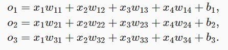
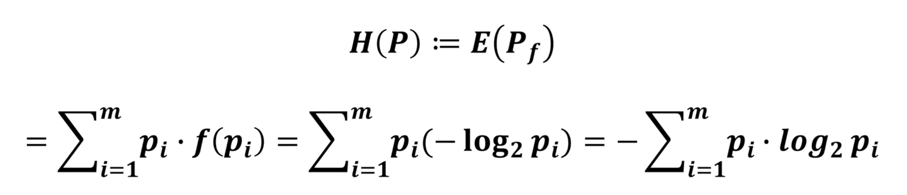
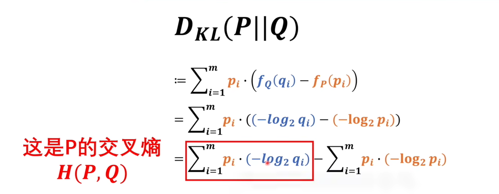
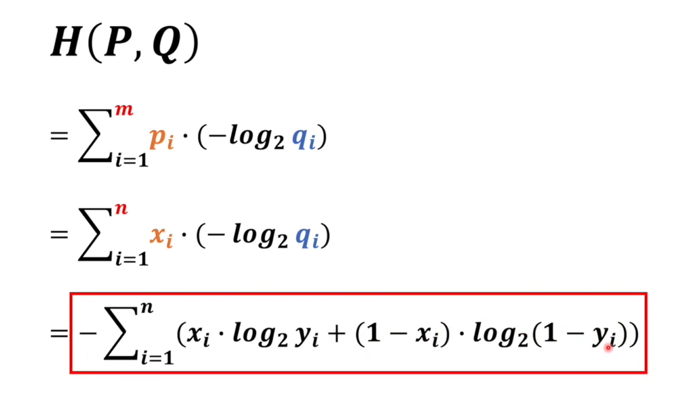

##线性神经网络
```py
d2l.plt.show()
```
###线性回归

#####线性假设
是指目标（房屋价格）可以表示为特征（面积和房龄）的**加权**和，如下面的式子：
$price = w$~area~·area + $w$~age~·age + b

$y = w_1x_1 + w_2x_2 + w_3x_3 +b$ 

$y = <w,x> + b$

#####预测质量
$l(X,y,w,b)=\frac{1}{2n}\sum_{i=1}^n{(y_i-<X_i,w>-b)^2}$
$=\frac{1}{2n}||y-Xw-b||^2$

目标是找到一个w和b的值使得整个loss函数最小

#####梯度下降gradient descent
利用J(w,b)分别对w和b做偏导
$w=w-\alpha\frac{\partial l}{\partial w}$

$b=b-\alpha\frac{\partial l}{\partial b}$

#####小批量随机梯度下降
随机采样b个样本损失取均值

超参数——批量大小b和学习率$\alpha$

###实现
####生成数据集
```py

import random
import torch
import torchvision
from d2l import torch as d2l
import os
os. environ["KMP_DUPLICATE_LIB_OK"]="TRUE"
#构造一个人造数据集
def synthetic_data(w, b, num_examples):  #@save
    """生成y=Xw+b+噪声"""
    #Returns a tensor of random numbers drawn from separate normal distributions whose mean and standard deviation are given.
    X = torch.normal(0, 1, (num_examples, len(w)))#torch.Size([1000, 2])
    #Matrix product of two tensors.
    y = torch.matmul(X, w) + b
    y += torch.normal(0, 0.01, y.shape)#torch.Size([1000, 1])
    return X, y.reshape((-1, 1))

true_w = torch.tensor([2, -3.4])
true_b = 4.2
features, labels = synthetic_data(true_w, true_b, 1000)
print(features.shape,labels.shape)
print('features:', features[0],'\nlabel:', labels[0])

d2l.set_figsize()
d2l.plt.scatter(features[:, 1].detach().numpy(), labels.detach().numpy(), 1)
#将features的第一列和labels进行绘图
#d2l.plt.show()

#定义一个函数能打乱数据集中的样本并以小批量方式获取数据。
'''
我们定义一个data_iter函数， 该函数接收批量大小、特征矩阵和标签向量作为输入，
生成大小为batch_size的小批量。 每个小批量包含一组特征和标签。
'''
def data_iter(batch_size, features, labels):
    num_examples = len(features)#样本个数
    indices = list(range(num_examples))#样本下标的list
    # 这些样本是随机读取的，没有特定的顺序
    random.shuffle(indices)#把下标完全打乱
    for i in range(0, num_examples, batch_size):#从0开始每b个取一个
        batch_indices = torch.tensor(
            indices[i: min(i + batch_size, num_examples)])
        yield features[batch_indices], labels[batch_indices]

batch_size = 10

for X, y in data_iter(batch_size, features, labels):
    print(X, '\n', y)
    break

```

####模型设置
```py
#初始化模型参数
w = torch.normal(0, 0.01, size=(2,1), requires_grad=True)
b = torch.zeros(1, requires_grad=True)

#定义模型
def linreg(X, w, b):  #@save
    """线性回归模型"""
    return torch.matmul(X, w) + b

#定义损失函数
def squared_loss(y_hat, y):  #@save
    """均方损失"""
    return (y_hat - y.reshape(y_hat.shape)) ** 2 / 2

#定义优化函数
def sgd(params, lr, batch_size):  #@save
    '''
    :param params:参数
    :param lr: 学习率
    :param batch_size:批量
    :return:
    '''
    """小批量随机梯度下降"""
    with torch.no_grad():#不需要计算梯度
        for param in params:
            param -= lr * param.grad / batch_size#除以均值
            param.grad.zero_()#梯度设为0
```

####训练过程
```py
#训练过程
lr = 0.03#学习率,不能太大
num_epochs = 3#把整个数据扫3遍
net = linreg#模型
loss = squared_loss#损失函数

for epoch in range(num_epochs):
    #每一次拿出batch_size的x,y
    for X, y in data_iter(batch_size, features, labels):
        l = loss(net(X, w, b), y)  # net做预测和y的小批量损失
        # 因为l形状是(batch_size,1)，而不是一个标量。l中的所有元素被加到一起，
        # 并以此计算关于[w,b]的梯度
        l.sum().backward()#求和之后算梯度
        sgd([w, b], lr, batch_size)  # 使用参数的梯度更新参数
    with torch.no_grad():
        train_l = loss(net(features, w, b), labels)#整个数据集的预测和实际的对比
        print(f'epoch {epoch + 1}, loss {float(train_l.mean()):f}')

#和真实参数的比较
true_w = torch.tensor([2, -3.4])
true_b = 4.2
print(f'w的估计误差: {true_w - w.reshape(true_w.shape)}')
print(f'b的估计误差: {true_b - b}')
```
###线性回归简洁实现
```py
import numpy as np
import torch
from torch.utils import data
from d2l import torch as d2l

true_w = torch.tensor([2, -3.4])
true_b = 4.2
features, labels = d2l.synthetic_data(true_w, true_b, 1000)

#读取数据集
def load_array(data_arrays, batch_size, is_train=True):  #@save
    """构造一个PyTorch数据迭代器"""
    dataset = data.TensorDataset(*data_arrays)
    return data.DataLoader(dataset, batch_size, shuffle=is_train)

batch_size = 10
data_iter = load_array((features, labels), batch_size)

next(iter(data_iter))

#定义模型

# nn是神经网络的缩写
from torch import nn

net = nn.Sequential(nn.Linear(2, 1))#输入是2，输出是1

net[0].weight.data.normal_(0, 0.01)#输入层的w的数据的随机化
net[0].bias.data.fill_(0)#输入层的b的数据初始为0

#定义损失函数
loss = nn.MSELoss()

#定义优化算法
trainer = torch.optim.SGD(net.parameters(), lr=0.03)#所有的参数和学习率


#训练
num_epochs = 3
for epoch in range(num_epochs):
    for X, y in data_iter:
        l = loss(net(X) ,y)
        trainer.zero_grad()#梯度清零
        l.backward()
        trainer.step()#自我更新
    l = loss(net(features), labels)#最后再算一次
    print(f'epoch {epoch + 1}, loss {l:f}')
```

##Softmax回归
回归
- 估计一个连续值
- 单连续数值输出
- 真实区间
- 跟真实值的区别作为损失

分类
- 预测一个离散类别
- 通常多个输出
- 输出i是预测为第i类的置信度

对类别进行一位有效编码
$y = [y_1,y_2,...,y_n]^T$
$y_i=${1 if i = y ; 0 otherwise}

由于我们有4个特征和3个可能的输出类别， 我们将需要12个标量来表示权重（带下标的w）， 3个标量来表示偏置（带下标的b）。 下面我们为每个输入计算三个未规范化的预测（logit）：o~1~、o~2~、o~3~


o = Wx +b

预测值
我们希望我们的输出是一个概率，softmax函数能够将未规范化的预测变换为非负数并且总和为1，同时让模型保持可导的性质。最后对o输出再进行如下处理

y^ = softmax(o)  其中 y^~j~=$\frac{exp(o_j)}{\sum_{k}{exp(o_k)}}$
就得到我们最后的结果

损失函数——交叉熵损失
$l(y,y$\^$)$$=-\sum_{i}{y_ilogy}$\^$=-logy$\^~y~


###损失函数
####最小二乘法
直接对比结果的相差值
$min\sum_{i=0}^n{(x_i-y_i)^2}$
$\frac{1}{2}\sum_{i=0}^n{(x_i-y_i)^2}$
####似然估计法
####交叉熵
信息量就是一个事情从不确定到确定。
熵可以定义成对某个系统求期望

把一个事件的信息量(log~2~p~i~)求出来，然后乘以其概率，最后求和。
要比较两个系统之间的差别，就利用KL散度值

也就是交叉熵与P的信息量之间的差值。而KL散度值经证明，一定是大于等于零的；即交叉熵越小说明两个模型越接近。则可以用做损失函数


###图像分类数据集
```py
import torch
import torchvision
from torch.utils import data
from torchvision import transforms
from d2l import torch as d2l
import os
os.environ["KMP_DUPLICATE_LIB_OK"]="TRUE"

d2l.use_svg_display()

# 通过ToTensor实例将图像数据从PIL类型变换成32位浮点数格式，
# 并除以255使得所有像素的数值均在0～1之间
trans = transforms.ToTensor()#图片格式转换

mnist_train = torchvision.datasets.FashionMNIST(
    root="../data", train=True, transform=trans, download=True)#导入训练数据集
mnist_test = torchvision.datasets.FashionMNIST(
    root="../data", train=False, transform=trans, download=True)#导入测试数据集

print(len(mnist_train) ,len(mnist_test))
print(mnist_train[0][0].shape)

#可视化数据集的函数
def get_fashion_mnist_labels(labels):  #@save
    """返回Fashion-MNIST数据集的文本标签"""
    text_labels = ['t-shirt', 'trouser', 'pullover', 'dress', 'coat',
                   'sandal', 'shirt', 'sneaker', 'bag', 'ankle boot']
    return [text_labels[int(i)] for i in labels]#用于在数字标签索引及其文本名称之间进行转换

def show_images(imgs, num_rows, num_cols, titles=None, scale=1.5):  #@save
    """绘制图像列表"""
    figsize = (num_cols * scale, num_rows * scale)
    _, axes = d2l.plt.subplots(num_rows, num_cols, figsize=figsize)
    axes = axes.flatten()
    for i, (ax, img) in enumerate(zip(axes, imgs)):
        if torch.is_tensor(img):
            # 图片张量
            ax.imshow(img.numpy())
        else:
            # PIL图片
            ax.imshow(img)
        ax.axes.get_xaxis().set_visible(False)
        ax.axes.get_yaxis().set_visible(False)
        if titles:
            ax.set_title(titles[i])
    return axes

X, y = next(iter(data.DataLoader(mnist_train, batch_size=18)))
#dataloader可以拿到一个确定大小的数据，构造一个iter，next就是拿到第一个小批量
show_images(X.reshape(18, 28, 28), 2, 9, titles=get_fashion_mnist_labels(y));
#画2行，每行9个图片
d2l.plt.show()#显示图片

#读取小批量
batch_size = 256

def get_dataloader_workers():  #@save
    """使用4个进程来读取数据"""
    return 4

train_iter = data.DataLoader(mnist_train, batch_size, shuffle=True,
                             num_workers=get_dataloader_workers())

#训练时长
timer = d2l.Timer()
for X, y in train_iter:
    continue
print(f'{timer.stop():.2f} sec')

#整合组件
def load_data_fashion_mnist(batch_size, resize=None):  #@save
    """下载Fashion-MNIST数据集，然后将其加载到内存中"""
    trans = [transforms.ToTensor()]
    if resize:#改变图片的尺寸
        trans.insert(0, transforms.Resize(resize))
    trans = transforms.Compose(trans)
    mnist_train = torchvision.datasets.FashionMNIST(
        root="../data", train=True, transform=trans, download=True)
    mnist_test = torchvision.datasets.FashionMNIST(
        root="../data", train=False, transform=trans, download=True)
    return (data.DataLoader(mnist_train, batch_size, shuffle=True,
                            num_workers=get_dataloader_workers()),
            data.DataLoader(mnist_test, batch_size, shuffle=False,
                            num_workers=get_dataloader_workers()))

#测试
train_iter, test_iter = load_data_fashion_mnist(32, resize=64)
for X, y in train_iter:
    print(X.shape, X.dtype, y.shape, y.dtype)
    break
```

###从头实现softmax回归
```py
import torch
from IPython import display
from d2l import torch as d2l
import os
os.environ["KMP_DUPLICATE_LIB_OK"]="TRUE"

batch_size = 256#批量
train_iter, test_iter = d2l.load_data_fashion_mnist(batch_size)#训练集和测试集的迭代器

#初始化模型参数
num_inputs = 784#图片拉成向量
num_outputs = 10#分为十类

W = torch.normal(0, 0.01, size=(num_inputs, num_outputs), requires_grad=True)#随机为高斯函数
b = torch.zeros(num_outputs, requires_grad=True)#初始为0

#定义softmax操作

def softmax(X):
    X_exp = torch.exp(X)
    partition = X_exp.sum(1, keepdim=True)
    return X_exp / partition  # 这里应用了广播机制

#实现softmax回归模型
def net(X):
    return softmax(torch.matmul(X.reshape((-1, W.shape[0])), W) + b)#x被reshape成756*284的矩阵#矩阵乘法

#定义损失函数
y = torch.tensor([0, 2])
y_hat = torch.tensor([[0.1, 0.3, 0.6], [0.3, 0.2, 0.5]])
y_hat[[0, 1], y]#对于y_hat有两个值，y则是真实的判断为第零类和第二类
#即分别拿出y_hat[0]对第零号类型的预测值和y_hat对第二号类型的预测值

def cross_entropy(y_hat, y):
    return - torch.log(y_hat[range(len(y_hat)), y])

#print(cross_entropy(y_hat, y))

#分类精度
def accuracy(y_hat, y):  #@save
    """计算预测正确的数量"""
    if len(y_hat.shape) > 1 and y_hat.shape[1] > 1:
        y_hat = y_hat.argmax(axis=1)#元素值最大的那个下标存到y_hat里
    cmp = y_hat.type(y.dtype) == y
    return float(cmp.type(y.dtype).sum())

#print(accuracy(y_hat, y) / len(y))#预测正确的概率

def evaluate_accuracy(net, data_iter):  #@save
    """计算在指定数据集上模型的精度"""
    if isinstance(net, torch.nn.Module):
        net.eval()  # 将模型设置为评估模式
    metric = Accumulator(2)  # 正确预测数、预测总数
    with torch.no_grad():
        for X, y in data_iter:
            metric.add(accuracy(net(X), y), y.numel())#分类正确的样本数和分类总数
    return metric[0] / metric[1]

class Accumulator:  #@save
    """在n个变量上累加"""
    def __init__(self, n):
        self.data = [0.0] * n

    def add(self, *args):
        self.data = [a + float(b) for a, b in zip(self.data, args)]

    def reset(self):
        self.data = [0.0] * len(self.data)

    def __getitem__(self, idx):
        return self.data[idx]

#训练
def train_epoch_ch3(net, train_iter, loss, updater):  #@save
    """训练模型一个迭代周期（定义见第3章）"""
    # 将模型设置为训练模式
    if isinstance(net, torch.nn.Module):#可以对手动和使用模组的两种情况分别处理
        net.train()
    # 训练损失总和、训练准确度总和、样本数
    metric = Accumulator(3)#长度为3的迭代器
    for X, y in train_iter:
        # 计算梯度并更新参数
        y_hat = net(X)#计算y_hat
        l = loss(y_hat, y)#计算损失函数
        if isinstance(updater, torch.optim.Optimizer):
            # 使用PyTorch内置的优化器和损失函数
            updater.zero_grad()#梯度设置为0
            l.mean().backward()#计算梯度
            updater.step()#更新参数
        else:
            # 使用（自己）定制的优化器和损失函数
            l.sum().backward()
            updater(X.shape[0])
        metric.add(float(l.sum()), accuracy(y_hat, y), y.numel())#记录分类正确的个数
    # 返回训练损失和训练精度
    return metric[0] / metric[2], metric[1] / metric[2]

#训练过程中的变化
class Animator:  #@save
    """在动画中绘制数据"""
    def __init__(self, xlabel=None, ylabel=None, legend=None, xlim=None,
                 ylim=None, xscale='linear', yscale='linear',
                 fmts=('-', 'm--', 'g-.', 'r:'), nrows=1, ncols=1,
                 figsize=(3.5, 2.5)):
        # 增量地绘制多条线
        if legend is None:
            legend = []
        d2l.use_svg_display()
        self.fig, self.axes = d2l.plt.subplots(nrows, ncols, figsize=figsize)
        if nrows * ncols == 1:
            self.axes = [self.axes, ]
        # 使用lambda函数捕获参数
        self.config_axes = lambda: d2l.set_axes(
            self.axes[0], xlabel, ylabel, xlim, ylim, xscale, yscale, legend)
        self.X, self.Y, self.fmts = None, None, fmts


    def add(self, x, y):
        # 向图表中添加多个数据点
        if not hasattr(y, "__len__"):
            y = [y]
        n = len(y)
        if not hasattr(x, "__len__"):
            x = [x] * n
        if not self.X:
            self.X = [[] for _ in range(n)]
        if not self.Y:
            self.Y = [[] for _ in range(n)]
        for i, (a, b) in enumerate(zip(x, y)):
            if a is not None and b is not None:
                self.X[i].append(a)
                self.Y[i].append(b)
        self.axes[0].cla()
        for x, y, fmt in zip(self.X, self.Y, self.fmts):
            self.axes[0].plot(x, y, fmt)
        self.config_axes()
        display.display(self.fig)
        display.clear_output(wait=True)


#训练函数
def train_ch3(net, train_iter, test_iter, loss, num_epochs, updater):  #@save
    """训练模型（定义见第3章）"""
    animator = Animator(xlabel='epoch', xlim=[1, num_epochs], ylim=[0.3, 0.9],
                        legend=['train loss', 'train acc', 'test acc'])
    for epoch in range(num_epochs):
        train_metrics = train_epoch_ch3(net, train_iter, loss, updater)
        test_acc = evaluate_accuracy(net, test_iter)
        animator.add(epoch + 1, train_metrics + (test_acc,))
    train_loss, train_acc = train_metrics
    assert train_loss < 0.5, train_loss
    assert train_acc <= 1 and train_acc > 0.7, train_acc
    assert test_acc <= 1 and test_acc > 0.7, test_acc

lr = 0.1

def updater(batch_size):
    return d2l.sgd([W, b], lr, batch_size)

num_epochs = 10#训练十个迭代周期
train_ch3(net, train_iter, test_iter, cross_entropy, num_epochs, updater)

#预测
def predict_ch3(net, test_iter, n=6):  #@save
    """预测标签（定义见第3章）"""
    for X, y in test_iter:
        break
    trues = d2l.get_fashion_mnist_labels(y)
    preds = d2l.get_fashion_mnist_labels(net(X).argmax(axis=1))
    titles = [true +'\n' + pred for true, pred in zip(trues, preds)]
    d2l.show_images(
        X[0:n].reshape((n, 28, 28)), 1, n, titles=titles[0:n])

predict_ch3(net, test_iter)

```
###Softmax回归简洁实现
```py
from mxnet import gluon, init, npx
from mxnet.gluon import nn
from d2l import mxnet as d2l

npx.set_np()

batch_size = 256
train_iter, test_iter = d2l.load_data_fashion_mnist(batch_size)#将数据拿到一个数据迭代器

#初始化模型参数

# PyTorch不会隐式地调整输入的形状。因此，
# 我们在线性层前定义了展平层（flatten），来调整网络输入的形状
net = nn.Sequential(nn.Flatten(), nn.Linear(784, 10))

def init_weights(m):
    if type(m) == nn.Linear:
        nn.init.normal_(m.weight, std=0.01)

net.apply(init_weights)
#损失函数
loss = nn.CrossEntropyLoss(reduction='none')

#优化算法
trainer = torch.optim.SGD(net.parameters(), lr=0.1)

#训练
num_epochs = 10
d2l.train_ch3(net, train_iter, test_iter, loss, num_epochs, trainer)

```
