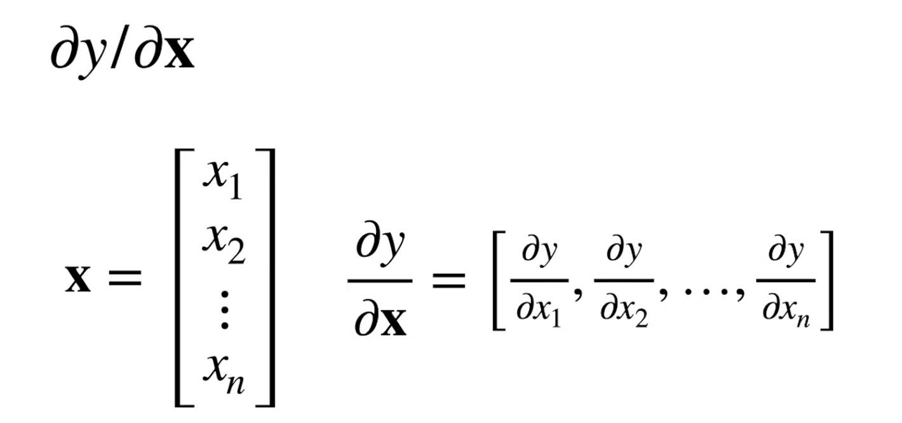
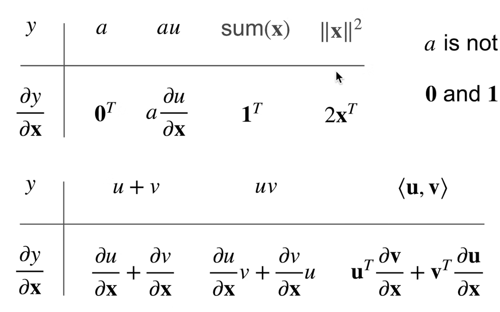
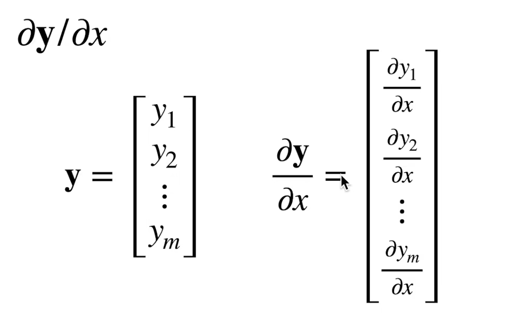
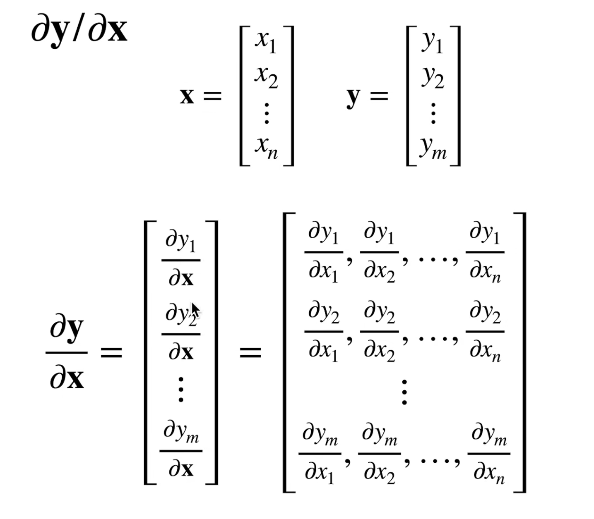
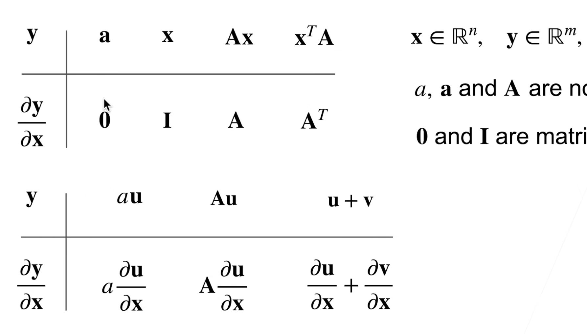

##预备知识

###数据操作

#####元素
一个元素[1,2]
一行[1,:]
一列[:,1]
子区域[1:3,1:]左闭右开
子区域[::3,::2]每三行一跳，每两列一跳
#####数据操作实现
```python

x = torch.arange(12)
#tensor张量表示维度
print(x)
#shape表示张量的形状和张量中元素的总数
print(x.shape)
#numel元素的种数
print(x.numel())
#reshape改变形状
x=x.reshape(3,4)
#初始化全零
y=torch.zeros((2,3,4))
#初始化全1
y=torch.ones((2,3,4))
#可以进行+-*/,**是求幂运算
#以e为低的指数函数
torch.exp(x)
import torch

#初始化特定的值
y=torch.tensor([[2,1,4,3],[2,1,4,3],[1,2,3,4]])
x=torch.arange(12,dtype=torch.float32).reshape((3,4))

#拼接
print(torch.cat((x,y),dim=0))#按行拼接
print(torch.cat((x,y),dim=1))#按列拼接
#可以逻辑判断是否相等
print(x==y)
#求和,产生只有一个元素的张量
print(x.sum())
#广播机制

x[-1]#最后一行
x[1:3]#第二行和第三行
x[1,2]=9#还可以写入
x[1:3,:]=9#多个元素赋值

id(y)#类似于c里的指针
#一些操作会导致新结果分配内存

y=y+x#会导致重新分配内存
y[:]=y+x#不会
y+=x#不会

#转换为Numpy张量
A=X.numpy()
B=torch.tensor(A)

#江大小为1的张量转换为python标量
a.item()
float(a)
int(a)
```
#####数据预处理

```py
import os
import torch

os.makedirs(os.path.join('..', 'data'), exist_ok=True)
data_file = os.path.join('..', 'data', 'house_tiny.csv')
with open(data_file, 'w') as f:
    f.write('NumRooms,Alley,Price\n')  # 列名
    f.write('NA,Pave,127500\n')  # 每行表示一个数据样本
    f.write('2,NA,106000\n')#NA是未知
    f.write('4,NA,178100\n')
    f.write('NA,NA,140000\n')

import pandas as pd

data = pd.read_csv(data_file)
print(data)

#处理缺失值
inputs, outputs = data.iloc[:, 0:2], data.iloc[:, 2]#取部分数据
inputs = inputs.fillna(inputs.mean())#fill NA #mean为剩下不是NA值的均值
print(inputs)

inputs = pd.get_dummies(inputs, dummy_na=True)#get_dummies将有值的赋1；dummy_na为true则给na值也分出一列
print(inputs)

#当所有条目都为数值时，就可以转换为张量格式
x , y= torch.tensor(inputs.values),torch.tensor(outputs.values)
print(x)
print(y)

```
###线性代数

```py

A=torch.arange(30).reshape(2,3,5)
print(A)
print(A.T)#转置
#对称矩阵:A = A.T

B=A.clone()#副本分配

#指定求和汇总张量的轴
A_sum_axis0=A.sum(axis=0)#torch.Size([3,5])
A_sum_axis0=A.sum(axis=[0,1])#torch.Size([5])

#均值
A.mean()
A.sum()/A.numel()

#也可以按照某个维度求均值
B=torch.arange(20,dtype=float).reshape((4,5))
print(B.mean(axis=1,keepdims=True))#保留维度不变

#按轴求和，哪个轴就会消失
A=torch.ones(20).reshape((4,5))
print(A.sum(axis=0).shape)#size([5])
print(A.sum(axis=0,keepdims=True).shape)#size([1,5])


#累加求和,会在后面多一个值
B.cumsum(axis=0)

#点积
torch.dot(x,y)
torch.sum(x*y)

#矩阵×向量
B=torch.arange(20,dtype=float).reshape((4,5))
x=torch.arange(5,dtype=float)
print(torch.mv(B,x).shape)#torch.size([4])

#矩阵×矩阵
torch.mm(A,B)

```
<font size=2>L2范数是向量元素平方和的平方根——**欧几里得范数**
$||x||$~2~=$\sqrt(\sum_{i=1}^n{x^2}$~i~$)$</font>

```py
u = torch.tensor([3.0,-4.0])
torch.norm(u)#tensor(5.)
```
<font size=2>L1范数是向量元素绝对值之和
$||x||$~1~=$(\sum_{i=1}^n{|x|}$~i~$)$</font>
```py
u = torch.tensor([3.0,-4.0])
torch.abs(u).sum()#tensor(7.)
```
<font size=2>矩阵的*佛罗贝尼乌斯范数 Frobrnius norm*是矩阵元素平方和的平方根
$||x||$~F~=$\sqrt(\sum_{i=1}^n{}\sum_{j=1}^n{x^2}$~ij~$)$</font>
```py
u = torch.tensor([[1.0,-1.0],[1.0,1.0]])
print(torch.norm(u))#tensor(2.)
```

###矩阵计算

标量y对向量$X$=[X~1~,X~2~,...]^T^（列向量）求导
[$\frac{\partial y}{\partial X_1},\frac{\partial y}{\partial X_2},...$ ]







向量$Y$=[Y~1~,Y~2~,...]^T^（列向量）对标量x求导
[$\frac{\partial Y_1}{\partial x},\frac{\partial Y_2}{\partial x},...$ ]^T^(竖)



向量$Y$对向量$X$求导







###自动求导

```py
x = torch.arange(4.0)
print(x)

x.requires_grad_(True)  # 等价于x=torch.arange(4.0,requires_grad=True)
print(x.grad)  # 默认值是None

y = 2 * torch.dot(x, x)
print(y)

#反向传播函数自动计算
y.backward()
print(x.grad)

# 在默认情况下，PyTorch会累积(+)梯度，我们需要清除之前的值
x.grad.zero_()
y = x.sum()
y.backward()
print(x.grad)

# 对非标量调用backward需要传入一个gradient参数，该参数指定微分函数关于self的梯度。
# 我们的目的不是计算微分矩阵，而是单独计算批量中每个样本的偏导数之和。
x.grad.zero_()
y = x * x
# 等价于y.backward(torch.ones(len(x)))
y.sum().backward()
print(x.grad)

#分离计算
x.grad.zero_()
y = x * x
u = y.detach()#u只是一个值为x*x的量，而不再与x相关
z = u * x

z.sum().backward()
#x.grad == u

x.grad.zero_()
y.sum().backward()#而y仍然是关于x的函数
#x.grad == 2 * x

#使用自动微分的一个好处是： 即使构建函数的计算图需要通过Python控制流（例如，条件、循环或任意函数调用），我们仍然可以计算得到的变量的梯度。
def f(a):
    b = a * 2
    while b.norm() < 1000:
        b = b * 2
    if b.sum() > 0:
        c = b
    else:
        c = 100 * b
    return c

a = torch.randn(size=(), requires_grad=True)
d = f(a)
d.backward()
print(a.grad)
```