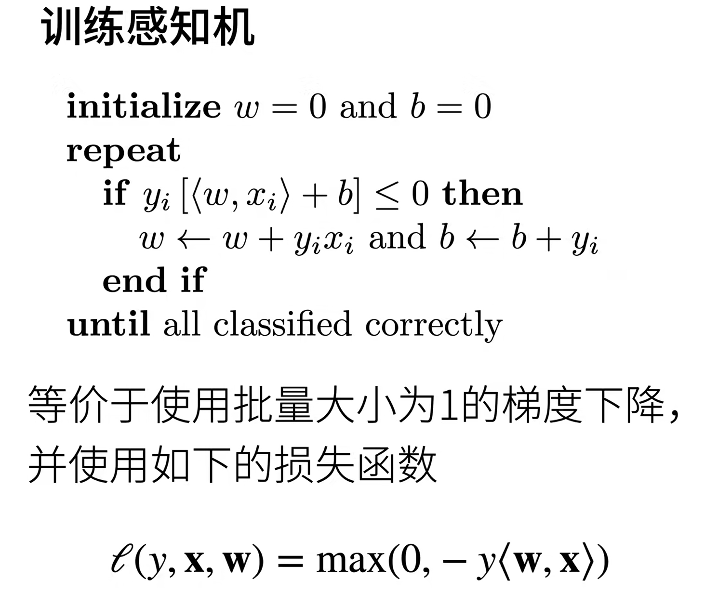
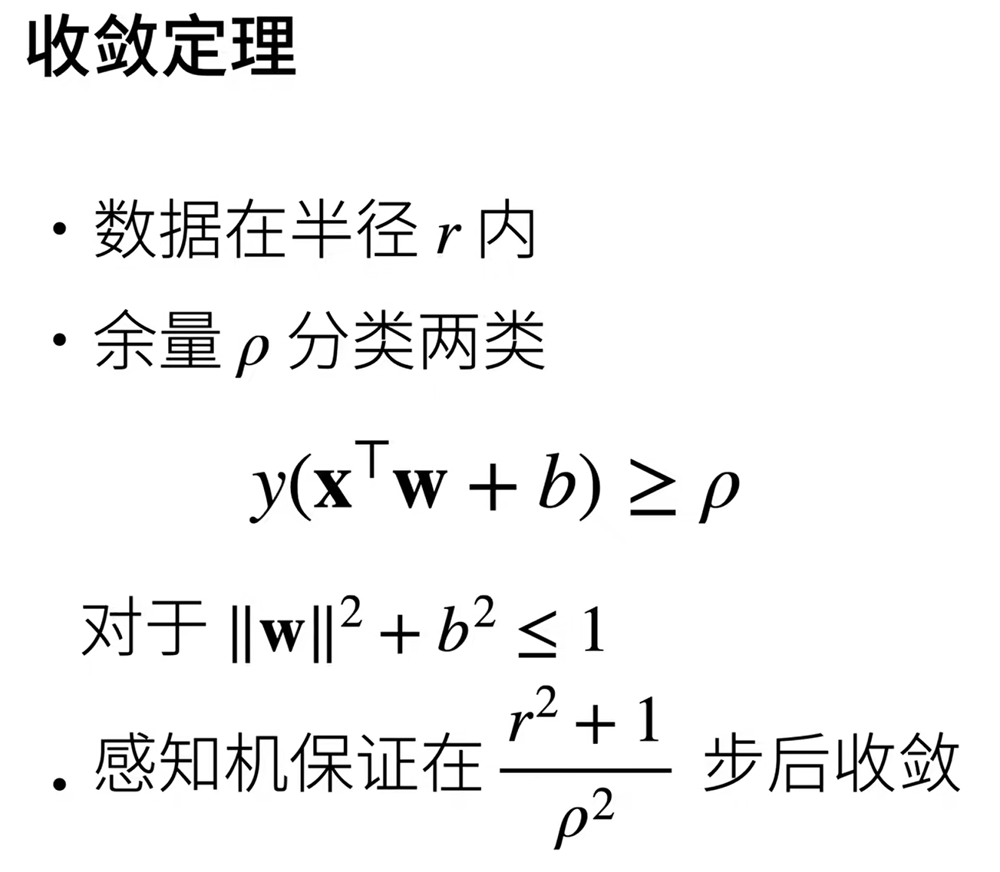
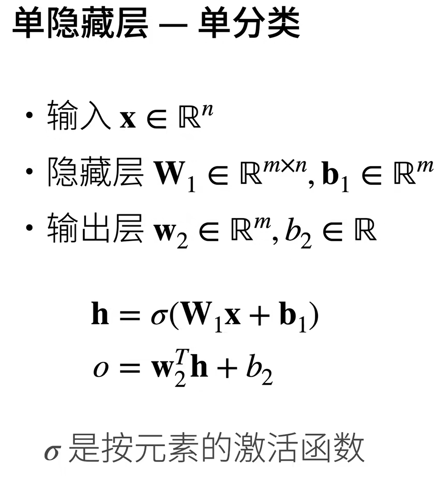
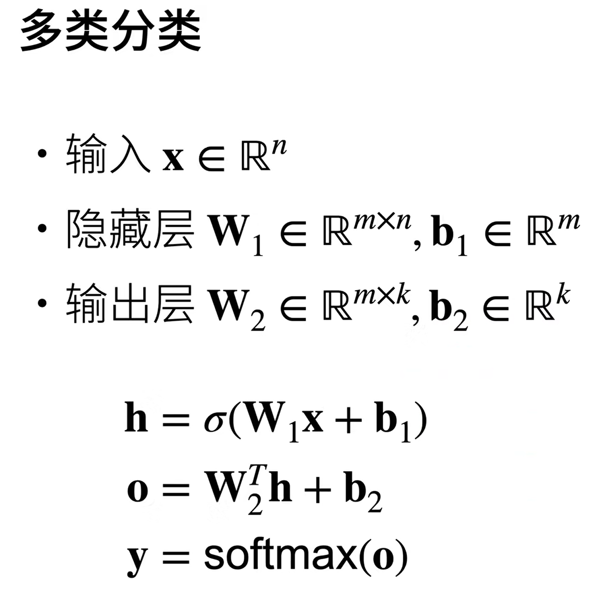
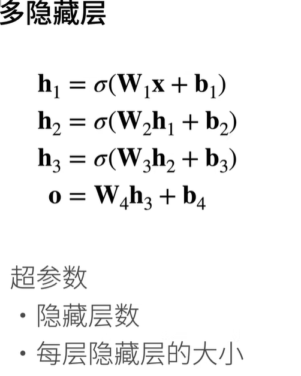
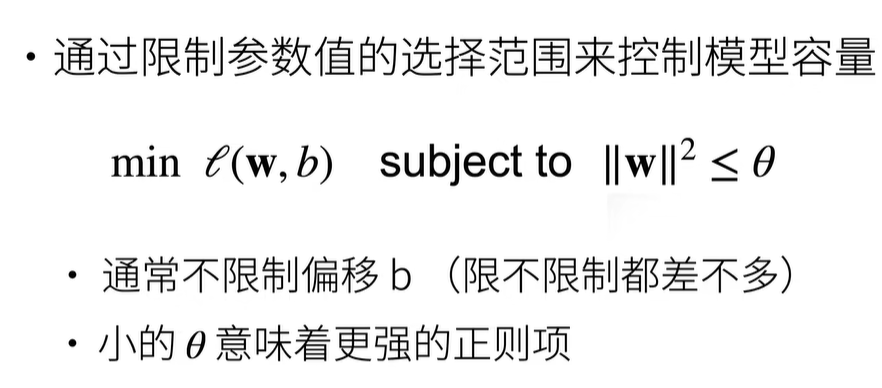
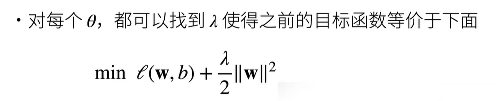
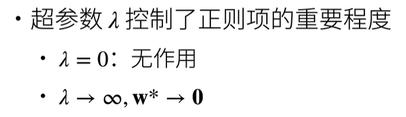
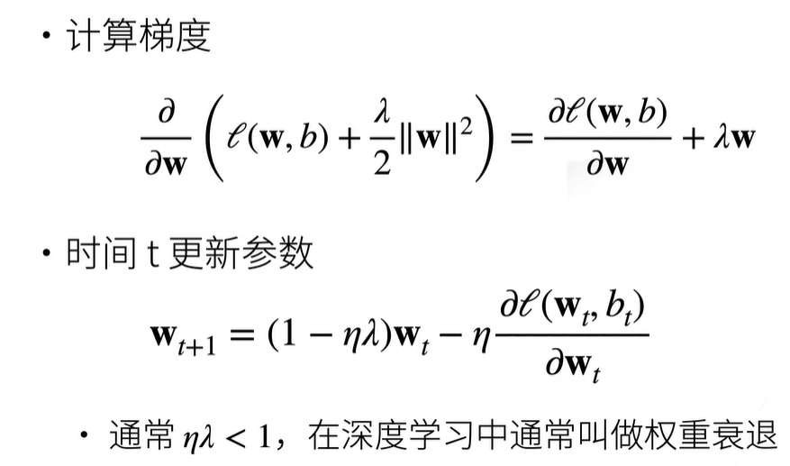

##多层感知机

###激活函数
$\sigma$
$tanh$
$ReLU(x) = max(x,0)$

###感知机
二分类
输出-1或者1

训练感知机

同号为正，异号为负。如果小于零则说明预测错误。
但是我不明白他的更新函数为何如此？？？？

收敛定理


感知机不能拟合XOR函数，它只能产生线性分割面

###多层感知机

单类分类


多类分类


多隐藏层


###多层感知机的代码实现
```py
import torch
from torch import nn
from d2l import torch as d2l
import os
os.environ["KMP_DUPLICATE_LIB_OK"]="TRUE"

batch_size = 256
train_iter, test_iter = d2l.load_data_fashion_mnist(batch_size)

#初始化模型
num_inputs, num_outputs, num_hiddens = 784, 10, 256

#第一层
W1 = nn.Parameter(torch.randn(
    num_inputs, num_hiddens, requires_grad=True) * 0.01)#权重
b1 = nn.Parameter(torch.zeros(num_hiddens, requires_grad=True))#偏差
#第二层
W2 = nn.Parameter(torch.randn(
    num_hiddens, num_outputs, requires_grad=True) * 0.01)
b2 = nn.Parameter(torch.zeros(num_outputs, requires_grad=True))

params = [W1, b1, W2, b2]

#激活函数
def relu(X):
    a = torch.zeros_like(X)
    return torch.max(X, a)

#实现模型
def net(X):
    X = X.reshape((-1, num_inputs))
    H = relu(X@W1 + b1)  # 这里“@”代表矩阵乘法
    return (H@W2 + b2)

#损失函数
loss = nn.CrossEntropyLoss(reduction='none')

#训练
num_epochs, lr = 10, 0.1
updater = torch.optim.SGD(params, lr=lr)
d2l.train_ch3(net, train_iter, test_iter, loss, num_epochs, updater)

#预测
d2l.predict_ch3(net, test_iter)

d2l.plt.show()#显示图片
```
###拟合与过拟合
####权重衰退
使用均方范数对w做一个硬性限制

直接把限制加入loss fuction中

柔性限制


梯度计算


权重衰退通过L2正则项使得模型参数不会过大，从而控制模型复杂度。
```py
import torch
from torch import nn
from d2l import torch as d2l

#生成一些数据
n_train, n_test, num_inputs, batch_size = 20, 100, 200, 5
true_w, true_b = torch.ones((num_inputs, 1)) * 0.01, 0.05
train_data = d2l.synthetic_data(true_w, true_b, n_train)
train_iter = d2l.load_array(train_data, batch_size)
test_data = d2l.synthetic_data(true_w, true_b, n_test)
test_iter = d2l.load_array(test_data, batch_size, is_train=False)

#初始化参数模型
def init_params():
    w = torch.normal(0, 1, size=(num_inputs, 1), requires_grad=True)
    b = torch.zeros(1, requires_grad=True)
    return [w, b]

#定义L2范数惩罚
def l2_penalty(w):
    return torch.sum(w.pow(2)) / 2#本节核心

#训练函数
def train(lambd):#多了一个参数lambd
    w, b = init_params()
    net, loss = lambda X: d2l.linreg(X, w, b), d2l.squared_loss
    num_epochs, lr = 100, 0.003
    animator = d2l.Animator(xlabel='epochs', ylabel='loss', yscale='log',
                            xlim=[5, num_epochs], legend=['train', 'test'])
    for epoch in range(num_epochs):
        for X, y in train_iter:
            # 增加了L2范数惩罚项，
            # 广播机制使l2_penalty(w)成为一个长度为batch_size的向量
            l = loss(net(X), y) + lambd * l2_penalty(w)#唯一不一样的地方
            l.sum().backward()
            d2l.sgd([w, b], lr, batch_size)
        if (epoch + 1) % 5 == 0:
            animator.add(epoch + 1, (d2l.evaluate_loss(net, train_iter, loss),
                                     d2l.evaluate_loss(net, test_iter, loss)))
    print('w的L2范数是：', torch.norm(w).item())
    
```
####丢弃法
无偏差的加入噪音
一定概率变成0一定概率变大
>$E[x']=x$
$x_i'=0$ with probablity $p$;
$=\frac{x_i}{1-p}$ otherise;

使用丢弃法：
>$h=\sigma(W_1x+b_1)$
$h'=dropout(h)$
$o=W_2h'+b_2$
$y=softmax(b)$

正则项只在训练的时候使用，预测时不需要正则。
通常将丢弃法作用在隐藏全连接层的输出上。
```py
import torch
from torch import nn
from d2l import torch as d2l


def dropout_layer(X, dropout):
    assert 0 <= dropout <= 1
    # 在本情况中，所有元素都被丢弃
    if dropout == 1:
        return torch.zeros_like(X)
    # 在本情况中，所有元素都被保留
    if dropout == 0:
        return X
    mask = (torch.rand(X.shape) > dropout).float()#mask要么是1要么是0
    return mask * X / (1.0 - dropout)

X= torch.arange(16, dtype = torch.float32).reshape((2, 8))
print(X)
print(dropout_layer(X, 0.))
print(dropout_layer(X, 0.5))
print(dropout_layer(X, 1.))

num_inputs, num_outputs, num_hiddens1, num_hiddens2 = 784, 10, 256, 256

dropout1, dropout2 = 0.2, 0.5

class Net(nn.Module):
    def __init__(self, num_inputs, num_outputs, num_hiddens1, num_hiddens2,
                 is_training = True):#是在测试还是在训练
        super(Net, self).__init__()
        self.num_inputs = num_inputs
        self.training = is_training
        self.lin1 = nn.Linear(num_inputs, num_hiddens1)
        self.lin2 = nn.Linear(num_hiddens1, num_hiddens2)
        self.lin3 = nn.Linear(num_hiddens2, num_outputs)
        self.relu = nn.ReLU()

    def forward(self, X):
        H1 = self.relu(self.lin1(X.reshape((-1, self.num_inputs))))
        # 只有在训练模型时才使用dropout
        if self.training == True:
            # 在第一个全连接层之后添加一个dropout层
            H1 = dropout_layer(H1, dropout1)
        H2 = self.relu(self.lin2(H1))
        if self.training == True:
            # 在第二个全连接层之后添加一个dropout层
            H2 = dropout_layer(H2, dropout2)
        out = self.lin3(H2)
        return out


net = Net(num_inputs, num_outputs, num_hiddens1, num_hiddens2)

#训练和测试
num_epochs, lr, batch_size = 10, 0.5, 256
loss = nn.CrossEntropyLoss(reduction='none')
train_iter, test_iter = d2l.load_data_fashion_mnist(batch_size)
trainer = torch.optim.SGD(net.parameters(), lr=lr)
d2l.train_ch3(net, train_iter, test_iter, loss, num_epochs, trainer)

```

简洁实现
```py
net = nn.Sequential(nn.Flatten(),#转成二维
        nn.Linear(784, 256),
        nn.ReLU(),
        # 在第一个全连接层之后添加一个dropout层
        nn.Dropout(dropout1),
        nn.Linear(256, 256),
        nn.ReLU(),
        # 在第二个全连接层之后添加一个dropout层
        nn.Dropout(dropout2),
        nn.Linear(256, 10))

def init_weights(m):
    if type(m) == nn.Linear:
        nn.init.normal_(m.weight, std=0.01)

net.apply(init_weights);

trainer = torch.optim.SGD(net.parameters(), lr=lr)
d2l.train_ch3(net, train_iter, test_iter, loss, num_epochs, trainer)
```

###数值稳定性

梯度爆炸
梯度消失
让训练更加稳定
- 将乘法变加法
- - ResNet LSTM
- 归一化
- - 梯度归一化 梯度裁剪
- 合理的权重初始和激活函数


