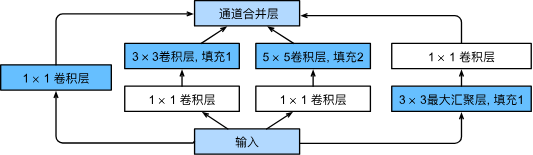
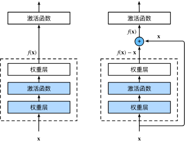
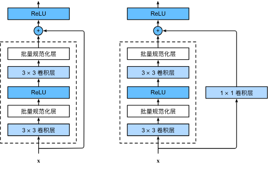

##现代卷积神经网络
###深度卷积神经网络AlexNet
AlexNet和LeNet的设计理念非常相似，但也存在显著差异。

AlexNet比相对较小的LeNet5要深得多。AlexNet由八层组成：五个卷积层、两个全连接隐藏层和一个全连接输出层。

AlexNet使用ReLU而不是sigmoid作为其激活函数

主要改进：
- 丢弃法
- ReLu
- MaxPooling

```py
import torch
from torch import nn
from d2l import torch as d2l
import os
os.environ["KMP_DUPLICATE_LIB_OK"]  =  "TRUE"

net = nn.Sequential(
    # 这里使用一个11*11的更大窗口来捕捉对象。
    # 同时，步幅为4，以减少输出的高度和宽度。
    # 另外，输出通道的数目远大于LeNet
    nn.Conv2d(1, 96, kernel_size=11, stride=4, padding=1), nn.ReLU(),
    nn.MaxPool2d(kernel_size=3, stride=2),
    # 减小卷积窗口，使用填充为2来使得输入与输出的高和宽一致，且增大输出通道数
    nn.Conv2d(96, 256, kernel_size=5, padding=2), nn.ReLU(),
    nn.MaxPool2d(kernel_size=3, stride=2),
    # 使用三个连续的卷积层和较小的卷积窗口。
    # 除了最后的卷积层，输出通道的数量进一步增加。
    # 在前两个卷积层之后，汇聚层不用于减少输入的高度和宽度
    nn.Conv2d(256, 384, kernel_size=3, padding=1), nn.ReLU(),
    nn.Conv2d(384, 384, kernel_size=3, padding=1), nn.ReLU(),
    nn.Conv2d(384, 256, kernel_size=3, padding=1), nn.ReLU(),
    nn.MaxPool2d(kernel_size=3, stride=2),
    nn.Flatten(),
    # 这里，全连接层的输出数量是LeNet中的好几倍。使用dropout层来减轻过拟合
    nn.Linear(6400, 4096), nn.ReLU(),
    nn.Dropout(p=0.5),
    nn.Linear(4096, 4096), nn.ReLU(),
    nn.Dropout(p=0.5),
    # 最后是输出层。由于这里使用Fashion-MNIST，所以用类别数为10，而非论文中的1000
    nn.Linear(4096, 10))

#和Lenet没有本质区别

X = torch.randn(1, 1, 224, 224)
for layer in net:
    X=layer(X)
    print(layer.__class__.__name__,'output shape:\t\t',X.shape)

'''
Conv2d output shape:		 torch.Size([1, 96, 54, 54])
ReLU output shape:		 torch.Size([1, 96, 54, 54])
MaxPool2d output shape:		 torch.Size([1, 96, 26, 26])
Conv2d output shape:		 torch.Size([1, 256, 26, 26])
ReLU output shape:		 torch.Size([1, 256, 26, 26])
MaxPool2d output shape:		 torch.Size([1, 256, 12, 12])
Conv2d output shape:		 torch.Size([1, 384, 12, 12])
ReLU output shape:		 torch.Size([1, 384, 12, 12])
Conv2d output shape:		 torch.Size([1, 384, 12, 12])
ReLU output shape:		 torch.Size([1, 384, 12, 12])
Conv2d output shape:		 torch.Size([1, 256, 12, 12])
ReLU output shape:		 torch.Size([1, 256, 12, 12])
MaxPool2d output shape:		 torch.Size([1, 256, 5, 5])
Flatten output shape:		 torch.Size([1, 6400])
Linear output shape:		 torch.Size([1, 4096])
ReLU output shape:		 torch.Size([1, 4096])
Dropout output shape:		 torch.Size([1, 4096])
Linear output shape:		 torch.Size([1, 4096])
ReLU output shape:		 torch.Size([1, 4096])
Dropout output shape:		 torch.Size([1, 4096])
Linear output shape:		 torch.Size([1, 10])
'''

#读取数据集
batch_size = 128
train_iter, test_iter = d2l.load_data_fashion_mnist(batch_size, resize=224)

#训练
lr, num_epochs = 0.01, 10
d2l.train_ch6(net, train_iter, test_iter, num_epochs, lr, d2l.try_gpu())
matplotlib.pyplot.show()
```

###使用块的网络VGG  
如何更好地：更深更大
VGG神经网络连接其中有超参数变量**conv_arch**。
该变量指定了每个VGG块里卷积层个数和输出通道数。
全连接模块则与AlexNet中的相同。
```py
import torch
from torch import nn
from d2l import torch as d2l
import os
os.environ["KMP_DUPLICATE_LIB_OK"]  =  "TRUE"

def vgg_block(num_convs, in_channels, out_channels):
    '''

    :param num_convs: 卷积层数
    :param in_channels: 输出通道
    :param out_channels: 输出通道
    :return:VGG块
    '''
    layers = []
    for _ in range(num_convs):
        layers.append(nn.Conv2d(in_channels, out_channels,
                                kernel_size=3, padding=1))
        layers.append(nn.ReLU())
        in_channels = out_channels
    layers.append(nn.MaxPool2d(kernel_size=2,stride=2))
    return nn.Sequential(*layers)

conv_arch = ((1, 64), (1, 128), (2, 256), (2, 512), (2, 512))#一共有五块，每一块（卷积，通道数）
def vgg(conv_arch):
    conv_blks = []
    in_channels = 1
    # 卷积层部分
    for (num_convs, out_channels) in conv_arch:
        conv_blks.append(vgg_block(num_convs, in_channels, out_channels))
        in_channels = out_channels
    #每一块调用vgg_block来构造块
    return nn.Sequential(
        *conv_blks, nn.Flatten(),
        # 全连接层部分
        nn.Linear(out_channels * 7 * 7, 4096), nn.ReLU(), nn.Dropout(0.5),
        nn.Linear(4096, 4096), nn.ReLU(), nn.Dropout(0.5),
        nn.Linear(4096, 10))

net = vgg(conv_arch)

X = torch.randn(size=(1, 1, 224, 224))
for blk in net:
    X = blk(X)
    print(blk.__class__.__name__,'output shape:\t',X.shape)

'''
Sequential output shape:	 torch.Size([1, 64, 112, 112])#高宽减半
Sequential output shape:	 torch.Size([1, 128, 56, 56])#通道翻倍，高宽减半
Sequential output shape:	 torch.Size([1, 256, 28, 28])
Sequential output shape:	 torch.Size([1, 512, 14, 14])
Sequential output shape:	 torch.Size([1, 512, 7, 7])
Flatten output shape:	 torch.Size([1, 25088])
Linear output shape:	 torch.Size([1, 4096])
ReLU output shape:	 torch.Size([1, 4096])
Dropout output shape:	 torch.Size([1, 4096])
Linear output shape:	 torch.Size([1, 4096])
ReLU output shape:	 torch.Size([1, 4096])
Dropout output shape:	 torch.Size([1, 4096])
Linear output shape:	 torch.Size([1, 10])
'''

ratio = 4
small_conv_arch = [(pair[0], pair[1] // ratio) for pair in conv_arch]
net = vgg(small_conv_arch)

lr, num_epochs, batch_size = 0.05, 10, 128
train_iter, test_iter = d2l.load_data_fashion_mnist(batch_size, resize=224)
d2l.train_ch6(net, train_iter, test_iter, num_epochs, lr, d2l.try_gpu())
```


###网络中的网络NiN
卷积层需要较少的参数，但是卷积层后地第一个全连接层地参数很大。
直接用1*1的卷积核，可以视为对于不同的通道，位于同一个通道矩阵的像素的权重是一致的，但效果和全连接层是一致的。


###含并行连结的网络GoogLeNet
什么是最好的卷积层超参数？
>四条路径都使用合适的填充来使输入与输出的高和宽一致，最后我们将每条线路的输出在通道维度上连结，并构成Inception块的输出。在Inception块中，通常调整的超参数是每层输出通道数。


inception有更少的参数个数和计算复杂度


###批量规范化Batch Normalization

####Feature Scaling
如果特征值相差非常大，但是在权重上相近，那么在loss fuction上不同的方向上，那么learning rate就要不同。
那么就对特征值做标准化，即**通过减去其均值并除以其标准差**


####Batch Normalization
并行化运算,对一个批量的特征值做标准化
$\mu = \frac{1}{B}\sum_{i=1}^{B}z^i$
$\sigma ^2 =\frac{1}{B}\sum_{i=1}^{B}(z^i-\mu)^2$
$\mu \sigma$会对back propagation有影响，在training的时候是会考虑进去的。
$\widetilde{z}=\frac{z-\mu}{\sigma}$
$\hat{z}^i=\gamma \odot \widetilde{z}^i+\beta$

$\mathrm{BN}(\mathbf{x}) = \boldsymbol{\gamma} \odot \frac{\mathbf{x} - \hat{\boldsymbol{\mu}}_\mathcal{B}}{\hat{\boldsymbol{\sigma}}_\mathcal{B}} + \boldsymbol{\beta}.$
$\gamma \beta$（are network parameters）可以使得最后输出不是均值0，方差1.

在testing stage是没有办法得到$\mu \sigma$
理想方法是用整个training dataset的$\mu \sigma$，
实际方法是记录训练过程中计算的$\mu \sigma$

能够减少梯度爆炸和梯度消失。
还可以对抗过拟合。

###残差网络ResNet
加更多层并不总是改进精度，因为可能会导致偏差。
通过一个$f(x)=x+g(x)$多把原来那个x加回去。


这样的设计要求2个卷积层的输出与输入形状一样，从而使它们可以相加。 如果想改变通道数，就需要引入一个额外的1*1卷积层来将输入变换成需要的形状后再做相加运算。

###稠密连接网络DenseNet
