##现代循环神经网络
###门控循环单元GRU
只关注相关的观察需要：
- 能关注的机制（更新门）
- 能遗忘的机制（重置门）

####重置门和更新门
$
\mathbf{R}_t = \sigma(\mathbf{X}_t \mathbf{W}_{xr} + \mathbf{H}_{t-1} \mathbf{W}_{hr} + \mathbf{b}_r),\\
\mathbf{Z}_t = \sigma(\mathbf{X}_t \mathbf{W}_{xz} + \mathbf{H}_{t-1} \mathbf{W}_{hz} + \mathbf{b}_z),
$
重置门允许我们控制“可能还想记住”的过去状态的数量；
更新门将允许我们控制新状态中有多少个是旧状态的副本

使用$\sigma$能够使得输入值转换到区间(0,1)
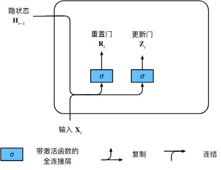

####候选隐状态
首先使用重置门控来得到“重置”之后的数据${\mathbf{H}}_{t-1}'=\mathbf{R}_t \odot \mathbf{H}_{t-1}$

$\tilde{\mathbf{H}}_t = \tanh(\mathbf{X}_t \mathbf{W}_{xh} + \left(\mathbf{R}_t \odot \mathbf{H}_{t-1}\right) \mathbf{W}_{hh} + \mathbf{b}_h),$
我们使用tanh非线性激活函数来确保候选隐状态中的值保持在区间(0,1)中

$\mathbf{R}_t \odot \mathbf{H}_{t-1}$能够减少以往状态的影响。
每当重置门$\mathbf{R}_t$中的项接近**1**时， 我们恢复一个普通的循环神经网络。
对于重置门$\mathbf{R}_t$中所有接近**0**的项， 候选隐状态是以作为输入的多层感知机的结果。
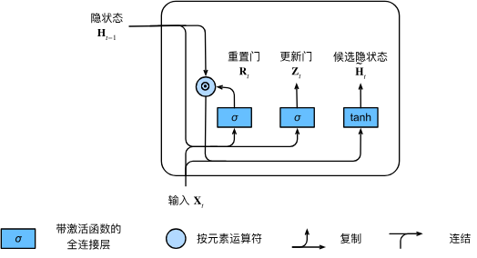

####隐状态
上述的计算结果只是候选隐状态，我们仍然需要结合更新门$\mathbf{Z}_t$的效果。
这一步确定新的隐状态$\mathbf{H}_t \in \mathbb{R}^{n \times h}$在多大程度上来自旧的状态$\mathbf{H}_{t-1}$和新的候选状态$\tilde{\mathbf{H}}_t$

$\mathbf{H}_t = \mathbf{Z}_t \odot \mathbf{H}_{t-1}  + (1 - \mathbf{Z}_t) \odot \tilde{\mathbf{H}}_t.$
每当更新门$\mathbf{Z}_t$接近**1**时，模型就倾向只保留旧状态。 此时，来自$\mathbf{X}_t$的信息基本上被忽略， 从而有效地跳过了依赖链条中的时间步t。
当$\mathbf{Z}_t$接近**0**时，新的隐状态$\mathbf{H}_t$就会接近候选隐状态。

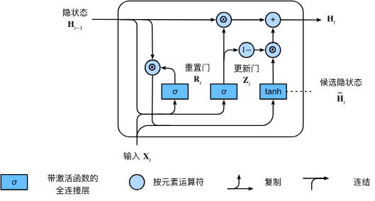

- 重置门有助于捕获序列中的短期依赖关系；
- 更新门有助于捕获序列中的长期依赖关系。
###长短期记忆网络LSTM
####门控记忆元
#####输入门i、忘记门f和输出门o
$
\mathbf{I}_t = \sigma(\mathbf{X}_t \mathbf{W}_{xi} + \mathbf{H}_{t-1} \mathbf{W}_{hi} + \mathbf{b}_i),\\
\mathbf{F}_t = \sigma(\mathbf{X}_t \mathbf{W}_{xf} + \mathbf{H}_{t-1} \mathbf{W}_{hf} + \mathbf{b}_f),\\
\mathbf{O}_t = \sigma(\mathbf{X}_t \mathbf{W}_{xo} + \mathbf{H}_{t-1} \mathbf{W}_{ho} + \mathbf{b}_o),
$
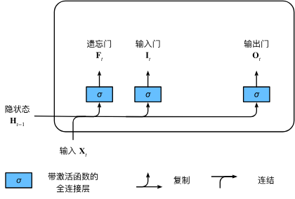
#####候选记忆元

$\tilde{\mathbf{C}}_t = \text{tanh}(\mathbf{X}_t \mathbf{W}_{xc} + \mathbf{H}_{t-1} \mathbf{W}_{hc} + \mathbf{b}_c),$

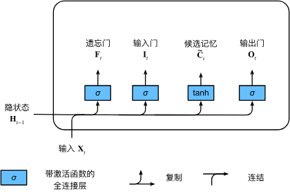
#####记忆元
$\mathbf{C}_t = \mathbf{F}_t \odot \mathbf{C}_{t-1} + \mathbf{I}_t \odot \tilde{\mathbf{C}}_t.$
输入门$\mathbf{I}_t$控制采用多少来自$\tilde{\mathbf{C}}_t$的新数据,
而遗忘门$\mathbf{F}_t$控制保留多少过去的记忆元$\mathbf{C}_{t-1} \in \mathbb{R}^{n \times h}$的内容。 

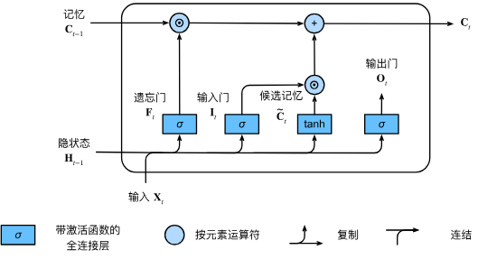
#####隐状态
$\mathbf{H}_t = \mathbf{O}_t \odot \tanh(\mathbf{C}_t).$
只要输出门接近**1**，我们就能够有效地将所有记忆信息传递给预测部分，
而对于输出门接近**0**，我们只保留记忆元内的所有信息，而不需要更新隐状态。
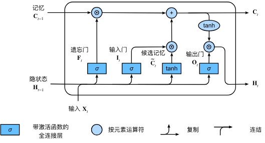


###深度循环神经网络
浅RNN：输入 隐层 输出
深RNN：输入 隐层 隐层 隐层 输出
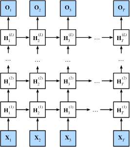

###双向循环神经网络
可以从前往后看，也可以从后往前看
>只需要增加一个“从最后一个词元开始从后向前运行”的循环神经网络， 而不是只有一个在前向模式下“从第一个词元开始运行”的循环神经网络。 双向循环神经网络（bidirectional RNNs） 添加了反向传递信息的隐藏层，以便更灵活地处理此类信息。

$
\overrightarrow{\mathbf{H}}_t = \phi(\mathbf{X}_t \mathbf{W}_{xh}^{(f)} + \overrightarrow{\mathbf{H}}_{t-1} \mathbf{W}_{hh}^{(f)}  + \mathbf{b}_h^{(f)}),\\
\overleftarrow{\mathbf{H}}_t = \phi(\mathbf{X}_t \mathbf{W}_{xh}^{(b)} + \overleftarrow{\mathbf{H}}_{t+1} \mathbf{W}_{hh}^{(b)}  + \mathbf{b}_h^{(b)}),\\
{\mathbf{H}}_{t}=[\overrightarrow{\mathbf{H}}_t,\overleftarrow{\mathbf{H}}_t]\\
\mathbf{O}_t = \mathbf{H}_t \mathbf{W}_{hq} + \mathbf{b}_q.
$
###机器翻译与数据集
####步骤
#####下载和预处理数据集
数据集中的每一行都是制表符分隔的**文本序列对**， 序列对由英文文本序列和翻译后的法语文本序列组成。 请注意，每个文本序列可以是一个句子， 也可以是一个段落。
```py
import os
import torch
from d2l import torch as d2l
import os
os.environ["KMP_DUPLICATE_LIB_OK"]  =  "TRUE"
#@save
d2l.DATA_HUB['fra-eng'] = (d2l.DATA_URL + 'fra-eng.zip',
                           '94646ad1522d915e7b0f9296181140edcf86a4f5')

#@save
def read_data_nmt():
    """载入“英语－法语”数据集"""
    data_dir = d2l.download_extract('fra-eng')
    with open(os.path.join(data_dir, 'fra.txt'), 'r',
             encoding='utf-8') as f:
        return f.read()

raw_text = read_data_nmt()
# print('rawtext')
# print(raw_text[:200])
#@save
def preprocess_nmt(text):
    """预处理“英语－法语”数据集"""
    def no_space(char, prev_char):
        return char in set(',.!?') and prev_char != ' '

    # 使用空格替换不间断空格
    # 使用小写字母替换大写字母
    text = text.replace('\u202f', ' ').replace('\xa0', ' ').lower()
    # 在单词和标点符号之间插入空格
    out = [' ' + char if i > 0 and no_space(char, text[i - 1]) else char
           for i, char in enumerate(text)]
    return ''.join(out)

text = preprocess_nmt(raw_text)
# print('preprocess text')
# print(text[120:180])

#词元化
#@save
def tokenize_nmt(text, num_examples=None):
    """词元化“英语－法语”数据数据集"""
    source, target = [], []
    for i, line in enumerate(text.split('\n')):
        if num_examples and i > num_examples:
            break
        parts = line.split('\t')
        if len(parts) == 2:
            source.append(parts[0].split(' '))
            target.append(parts[1].split(' '))
    return source, target

source, target = tokenize_nmt(text)
# print('token')
# print(source[1000:1016])#英语
# print(target[1000:1016])#法语
#就是把一整个句子都切分成一个个的单词

#@save
def show_list_len_pair_hist(legend, xlabel, ylabel, xlist, ylist):
    """绘制列表长度对的直方图"""
    d2l.set_figsize()
    _, _, patches = d2l.plt.hist(
        [[len(l) for l in xlist], [len(l) for l in ylist]])
    d2l.plt.xlabel(xlabel)
    d2l.plt.ylabel(ylabel)
    for patch in patches[1].patches:
        patch.set_hatch('/')
    d2l.plt.legend(legend)

show_list_len_pair_hist(['source', 'target'], '# tokens per sequence',
                        'count', source, target)

# d2l.plt.show()
#对句子长度绘制一个直方图

#词汇表

src_vocab = d2l.Vocab(source, min_freq=2,
                      reserved_tokens=['<pad>', '<bos>', '<eos>'])#特殊的词填充

# 这里构造了源语言source的vocab
# print('len of vocab')
# print(len(src_vocab))


# 截断或者填充
#@save
def truncate_pad(line, num_steps, padding_token):
    """截断或填充文本序列"""
    if len(line) > num_steps:
        return line[:num_steps]  # 截断
    return line + [padding_token] * (num_steps - len(line))  # 填充

# print(truncate_pad(src_vocab[source[100]], 10, src_vocab['<pad>']))

#把每个句子构造成固定的长度

#@save
def build_array_nmt(lines, vocab, num_steps):
    """将机器翻译的文本序列转换成小批量"""
    lines = [vocab[l] for l in lines]
    lines = [l + [vocab['<eos>']] for l in lines]#每个句子后面加一个结束词
    array = torch.tensor([truncate_pad(
        l, num_steps, vocab['<pad>']) for l in lines])
    valid_len = (array != vocab['<pad>']).type(torch.int32).sum(1)#句子实际长度
    return array, valid_len


# 整合成一整个模型

#@save
def load_data_nmt(batch_size, num_steps, num_examples=600):
    """返回翻译数据集的迭代器和词表"""
    text = preprocess_nmt(read_data_nmt())
    # 预处理
    source, target = tokenize_nmt(text, num_examples)
    # 变成source 和 target
    src_vocab = d2l.Vocab(source, min_freq=2,
                          reserved_tokens=['<pad>', '<bos>', '<eos>'])
    tgt_vocab = d2l.Vocab(target, min_freq=2,
                          reserved_tokens=['<pad>', '<bos>', '<eos>'])
    # source and target各自构造一个vocab
    src_array, src_valid_len = build_array_nmt(source, src_vocab, num_steps)
    tgt_array, tgt_valid_len = build_array_nmt(target, tgt_vocab, num_steps)
    # source and target
    data_arrays = (src_array, src_valid_len, tgt_array, tgt_valid_len)

    data_iter = d2l.load_array(data_arrays, batch_size)
    # 是会对整个文本进行处理，但最后返回的是根据你的批量大小返回的
    return data_iter, src_vocab, tgt_vocab

train_iter, src_vocab, tgt_vocab = load_data_nmt(batch_size=2, num_steps=8)
# for X, X_valid_len, Y, Y_valid_len in train_iter:
#     print('X:', X.type(torch.int32))
#     print('X的有效长度:', X_valid_len)
#     print('Y:', Y.type(torch.int32))
#     print('Y的有效长度:', Y_valid_len)
#     break
```


###编码器encoder-解码器decoder架构
机器翻译是序列转换模型的一个核心问题， 其输入和输出都是长度可变的序列。 为了处理这种类型的输入和输出， 我们可以设计一个包含两个主要组件的架构： 
第一个组件是一个编码器（encoder）： 它接受一个长度可变的序列作为输入， 并将其转换为具有固定形状的编码状态。 
第二个组件是解码器（decoder）： 它将固定形状的编码状态映射到长度可变的序列。

简单来说传统的模型是固定长度的输入和固定长度的输出，但是文本是变长的，于是编码器和解码器就充当中间层。

编码器：将文本表示成向量
解码器：向量表示成输出

迭代隐状态的过程可以看作编码过程，最后分类器看作解码器
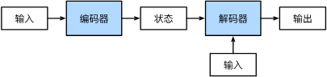


```py
from torch import nn


# @save
class Encoder(nn.Module):
    """编码器-解码器架构的基本编码器接口"""

    def __init__(self, **kwargs):
        super(Encoder, self).__init__(**kwargs)

    def forward(self, X, *args):
        raise NotImplementedError


"""
raise用于手动设置异常
"""


# 给一个x会给输出的状态

# @save
class Decoder(nn.Module):
    """编码器-解码器架构的基本解码器接口"""

    def __init__(self, **kwargs):
        super(Decoder, self).__init__(**kwargs)

    def init_state(self, enc_outputs, *args):
        raise NotImplementedError

    def forward(self, X, state):
        raise NotImplementedError


# 合并编码器和解码器
# @save
class EncoderDecoder(nn.Module):
    """编码器-解码器架构的基类"""

    def __init__(self, encoder, decoder, **kwargs):
        super(EncoderDecoder, self).__init__(**kwargs)
        self.encoder = encoder
        self.decoder = decoder

    def forward(self, enc_X, dec_X, *args):
        enc_outputs = self.encoder(enc_X, *args)
        dec_state = self.decoder.init_state(enc_outputs, *args)
        return self.decoder(dec_X, dec_state)
```

###序列到序列学习（seq2seq）
#####训练：
训练的时候是知道目标句子的
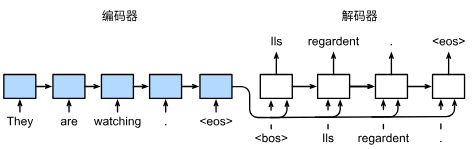

#####预测
遵循编码器－解码器架构的设计原则， 循环神经网络编码器使用长度可变的序列作为输入， 将其转换为固定形状的隐状态。
换言之，输入序列的信息被编码到循环神经网络编码器的隐状态中。 为了连续生成输出序列的词元， 独立的循环神经网络解码器是基于**输入序列的编码信息** 和**输出序列已经看见的或者生成的词元**来预测下一个词元。
机器翻译中编码器可以做双向，因为只是读入一个句子。
编码器和解码器都是一个RNN。
输出的长度是可以变换的，直到出现一个\<eos>
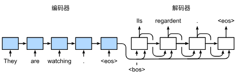
推理是没有真正输出的句子的，只能用上一刻的输出作为输入。
#####细节
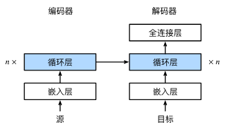

#####衡量好坏BLEU
- P~n~是预测中所有n-gram的精度
  - 标签序列ABCDEF和预测序列ABBCD，中有p~1~=4/5（连续一个的token是否在标签序列中出现）,p~2~=3/4（连续两个的token是否在标签序列中出现）
- BLEU定义
  $exp(min(0,1-\frac{len_{label}}{len_{pred}}))\prod_{n=1}^{k}p_{n}^{1/2^n}$
  - 惩罚过短的预测 len of pred 相对越小越低
  - 长匹配有高权重 n越大越高

```py

```
###束搜索
贪心搜索并不一定最优，但是要最优需要遍历所有可能。显然不可能。
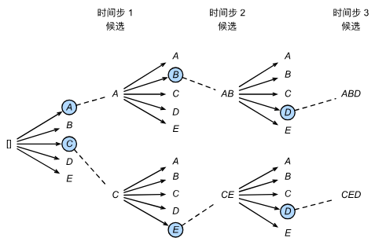
从选一个最好的，选择k个最好的
$\frac{1}{L^\alpha} \log P(y_1, \ldots, y_{L}\mid \mathbf{c}) = \frac{1}{L^\alpha} \sum_{t'=1}^L \log P(y_{t'} \mid y_1, \ldots, y_{t'-1}, \mathbf{c}),$