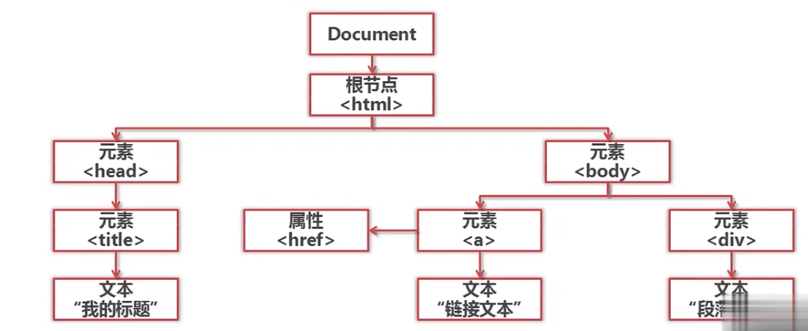

###网页下载器
用以下方法解决没有urllib2的问题
```
import urllib.request as urllib2
import urllib
```
#####方法1
```py
import urllib.request as urllib2
import urllib

url='http://www.baidu.com'
# 直接请求,用urlib.request代替urllib2
response = urllib2.urlopen(URL)
# 获取状态码，如果是200表示获取成功
print (response.getcode())
#读取内容
cont = response.read()
```
>关于headers：
>检查——network——name——headers
#####方法2
```py
import urllib.request as urllib2
import urllib

#创建Request对象
request = urllib2.Request('http://www.baidu.com')
#添加数据
request.add_header('User-Agent','Mozilla/5.0 (Windows NT 10.0; Win64; x64) AppleWebKit/537.36 (KHTML, like Gecko) Chrome/116.0.0.0 Safari/537.36')
response =urllib2.urlopen(request)
print(response.getcode())

```

#####方法3（特殊情景）
登录：HTTPCookieProcessor
代理：ProxyHandler
加密：HTTPSHandler
自动跳转关系：HTTPRedirectHandler
```
import urllib.request as urllib2
import urllib
from http import cookiejar

#创建cookie容器，存储cookie数据
cj = cookiejar.CookieJar()
#handler——bulid方法——创建一个opener
opener= urllib2.build_opener(urllib2.HTTPCookieProcessor(cj))
#给urllib2安装opner
urllib2.install_opener(opener)
#使用嗲有cookie的urllib2访问网页
reponse = urllib2.urlopen('http://www.baidu.com')
print(reponse.getcode())
```
***
###网页解析器
>正则表达——模糊匹配
>beautiful soup结构化解析


#####beautifu soup 语法
>\<a href='123.html' class='article_link'> python \</a>
>a为节点名称
>href为节点属性
>class为节点属性
>python为节点内容

```py
from bs4 import BeautifulSoup
#html文件
html_doc = """
<html><head><title>The Dormouse's story</title></head>
<body>
<p class="title"><b>The Dormouse's story</b></p>

<p class="story">Once upon a time there were three little sisters; and their names were
<a href="http://example.com/elsie" class="sister" id="link1">Elsie</a>,
<a href="http://example.com/lacie" class="sister" id="link2">Lacie</a> and
<a href="http://example.com/tillie" class="sister" id="link3">Tillie</a>;
and they lived at the bottom of a well.</p>

<p class="story">...</p>
"""
#根据HTML网页字符串创建beautiful soup 对象
soup = BeautifulSoup(
    html_doc, #html文档字符串
    'html.parser',#html解析器
    from_encoding='utf-8'#html文档编码
)

#搜索全部节点
links = soup.find_all('a')#name为a
#打印内容
for link in links:
    print(link.name,link['href'],link.get_text())

#搜索一个节点
link_node = soup.find('a',href='http://example.com/lacie')
print(link_node.get_text())

#正则匹配
import re
link_node = soup.find('a',href=re.compile(r"ill"))
print(link_node.get_text())

p_node = soup.find('p',class_='title')#class为py的关键字，故加下划线
print(p_node.get_text())
```


