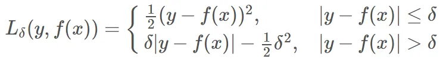

### MSE 
均方误差（Mean Square Error
$1/m \sum_{i=1}^m(y_i - f(x_i))^2$
如果样本中存在**离群点**，MSE 会给离群点赋予更高的权重，但是却是以牺牲其他正常数据点的预测效果为代价，这最终会降低模型的整体性能。

### MAE 
平均绝对误差（Mean Absolute Error
$1/m \sum_{i=1}^m|y_i - f(x_i)|$
存在**不可导点**；MAE 大部分情况下**梯度都是相等的**，这意味着即使对于小的损失值，其梯度也是大的。这不利于函数的收敛和模型的学习。

MSE收敛速度比MAE快。
离群点终于MSE，不重要MAE。

###  Huber Loss

处处可导

### CE
交叉熵

### GCE
适用于分类

### GMAE
from *General Debiasing for Multimodal Sentiment Analysis*
用于训练去偏extractor

