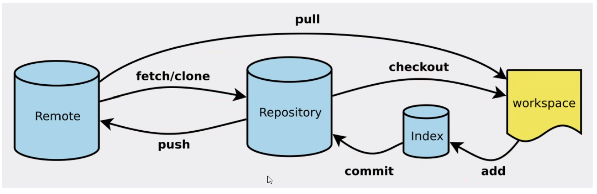
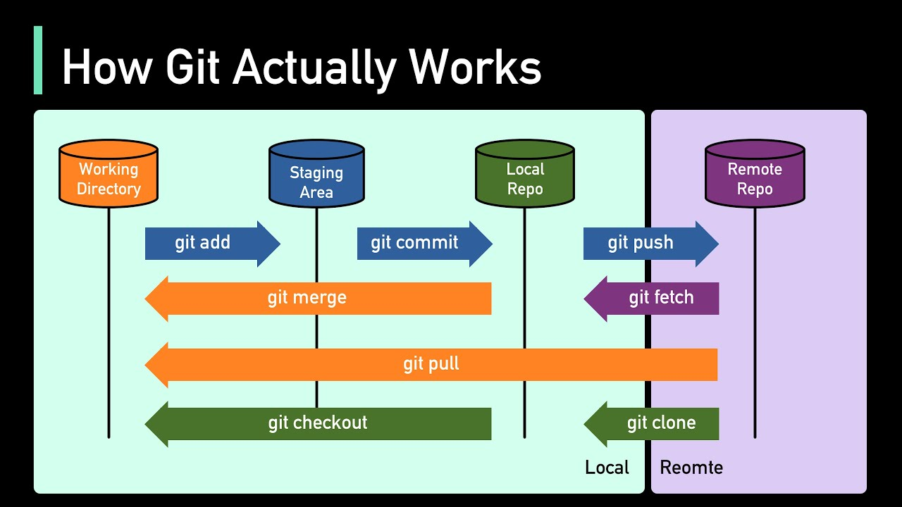

# linux命令
cd
cd ..
pwd 显示当前所在的目录路径
ls
touch 新建文件
rm
mkdir 新建目录
rm -r
mv 移动文件
reset 初始化终端
clear
history 查看命令历史
help
exit
#表示注释

# git命令
```
git config --list 查看配置
    --system 系统配置
    --global 本地
```

## 设置全局用户信息
```
git config --global user.name "Your Name"
git config --global user.email "your.email@example.com"
```



## 创建一个新的项目
```py

git init

# 添加文件
git add .

# 添加信息 “可以填任何信息”
git commit -m "first commit"

# 分支命名
git branch -M main

# 关联远程仓库
git remote add origin <URL>

# 推送至远程仓库
git push -u origin main
```
origin 是远程仓库的名称，指向远程仓库的 URL。
main 是你的本地分支的名称，表示你当前的主要开发分支。

## 连接至原有的git项目
```py
git init

git clone <URL>
# URL用SSH更好

# 关联至远程仓库
git remote add origin <URL>

# 分支命名
git branch -M main
```
不同主机上分支名一直 可以保证代码移植


## 上传
```py
git add .

git commit -m "info"

git push
```

## 下载
```py
git pull
```


## 修改远程仓库的URL
`git remote set-url origin 新的远程仓库URL`

## 生成ssh密钥
```py
ssh-keygen -t ed25519 -C "your_email@example.com"
[press enter]
[type a 密码]
```
然后在自己的账户上添加就可以了

## ssh连接
```py
git remote set-url origin git@github.com:<username>/<repository>.git
```
## ignore文件
#开头的行是 注释。
*.log 忽略所有 .log 结尾的文件。
!important.log 例外规则，表示 不忽略 important.log。
/node_modules/ 忽略 node_modules 目录（/ 表示目录）。
/dist/ 只忽略仓库根目录下的 dist/，但不影响子目录的 dist/。
debug/ 忽略所有 debug 目录，不管在哪里。


