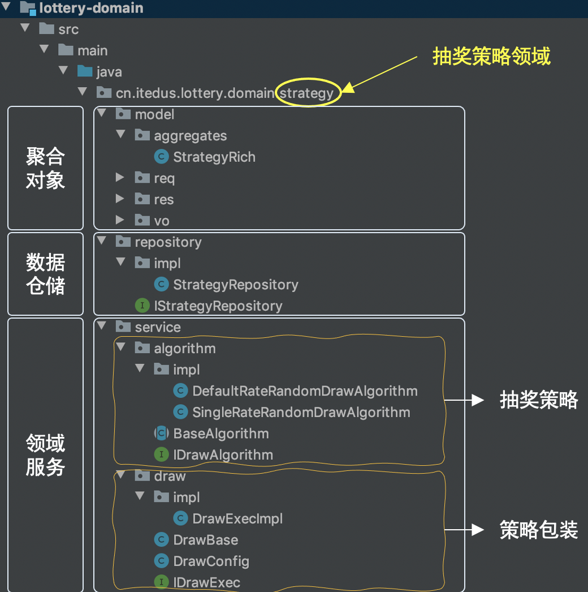
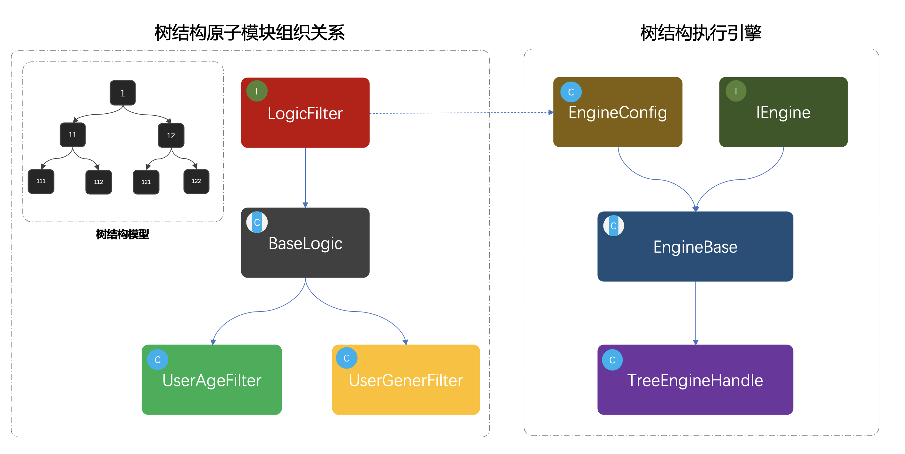
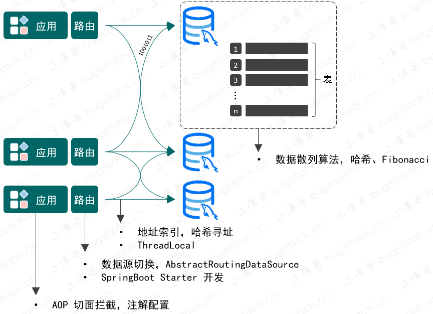
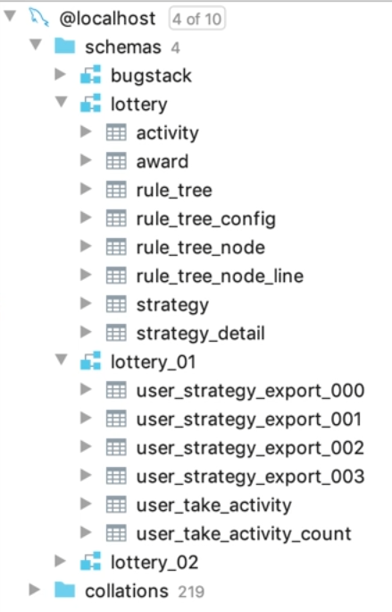
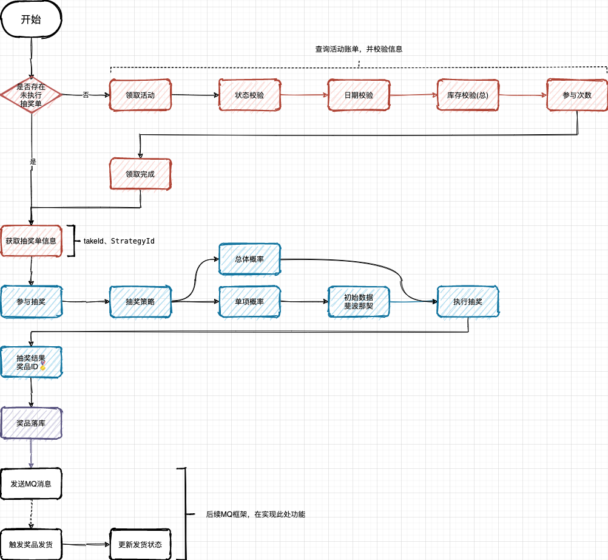

# 工程列表
1. Lottery
2. Lottery-API
3. Lottery-front
4. Lottery-ERP
5. db-router-spring-boot-starter
6. Lottery-Test
# 领域层
## 抽奖策略

### 1. `model` 包
把抽奖过程中涉及到的各种信息分类存放
- **`aggregates` 子包及 `StrategyRich` 类**
    - 聚合对象相关。在 DDD 中，聚合是一组相关对象集合，作为整体被外界访问。
    - `StrategyRich` 可能封装抽奖策略相关聚合信息，形成聚合根，便于业务逻辑处理与数据管理。
 - **`req` 子包**
    - 存放请求相关数据模型。
    - 用户请求数据
 - **`res` 子包**
    - 存放响应相关数据模型。
    - 中奖结果
 - **`vo` 子包**
    - 存放 Value Object（值对象）。
    - 值对象不可变，用于表示简单数据组合，如抽奖活动名称、描述等，主要用于传输数据。

### 2. `repository` 包
 - **`impl` 子包及 `StrategyRepository` 类**
    - `repository` 包负责数据仓储服务，统一封装底层数据库（如 MySQL、Redis 等）操作。
    - `StrategyRepository` 类是具体实现类，实现 `IStrategyRepository` 接口，处理抽奖策略相关数据存储和读取，如保存配置信息、读取历史记录等。
 - **`IStrategyRepository` 接口**
    - 定义抽奖策略数据仓储相关方法签名，规范数据访问层操作，使上层业务逻辑不依赖具体数据库实现，提高代码可维护性和扩展性。

### 3. `service` 包
 - **`algorithm` 子包**
    - **`impl` 子包**
        - `DefaultRateRandomDrawAlgorithm` 
        -    `SingleRateRandomDrawAlgorithm`
    - **`BaseAlgorithm` 类**
        - 作为抽奖算法基类，定义通用方法和属性。
        - 继承IDrawAlgorithm
    - **`IDrawAlgorithm` 接口**
        - 定义抽奖算法标准接口
        - 初始化元组
        - 判断是否完成初始化
        - 生成随机数
 - **`draw` 子包**
    - **`impl` 子包及 `DrawExecImpl` 类**
        - `DrawExecImpl` 抽奖流程的实现类，对AbstractDrawBase抽象方法进行实现即可。
    - **`AbstractDrawBase`**
      - 定义了抽奖流程的骨架，包含模板方法等抽象的流程定义。**模板模式**
      - 继承DrawStrategySupport，实现IDrawExec
    - **`DrawStrategySupport` 类**
        - 继承Config
        - 根据配置信息，可以完成数据库查询策略、查询奖品等操作
   
    - **`DrawConfig` 类**
        - 配置一些信息

    - **`IDrawExec` 接口**
        - 对外部的接口。 
        - `DrawResult doDrawExec(DrawReq req)`具体的执行步骤就是由模板类定义的


## 发奖领域
采用**简单工厂模式**，不想写太多if-else。允许子类决定实例化对象的类型
### factory
- DistributionGoodsFactory.java
    `public IDistributionGoods getDistributionGoodsService(Integer awardType){return goodsMap.get(awardType);}`
根据物品信息返回配送结果
通过map代替if-else
- GoodsConfig.java
  - 把多种奖品的发奖，放到一个统一的配置文件类 Map 中，便于通过 AwardType 获取相应的对象，减少 if...else 的使用。
  - 之后有新的奖品类型只需要在这里配置上
### goods
- impl
   不同的奖品类
   也可以添加新的奖品
- DistributionBase.java
- IDistributionGoods接口
  `doDistribution(GoodsReq req);`

## 活动领域
使用**状态模式**
- AbstractState.java
  在整个接口中提供了各项状态流转服务的接口，例如；活动提审、审核通过、审核拒绝、撤审撤销等7个方法。
在这些方法中所有的入参都是一样的，activityId(活动ID)、currentStatus(当前状态)，只有他们的具体实现是不同的。

IStateHandler.java
StateConfig.java

### deploy
第十一节，这里关于路由的部分不是特别懂啊
用来创建活动
添加活动配置
添加策略配置
添加奖励配置
### partake
领取活动领域，采用**模板模式**开发
- impl
  ActivityPartakeImpl
- ActivityPartakeSupport
  一些通用的数据服务
- BaseActivityPartake
  `public abstract class BaseActivityPartake extends ActivityPartakeSupport implements IActivityPartake`
  使用模板模式定义领取过程

  1. 查询活动账单
  2. 活动信息校验
  3. 扣减库存
  4. 插入领取活动信息
  5. 封装结果
- IActivityPartake
  `doPartake();`接口
### stateflow

状态流转运用的状态模式，主要包括抽象出状态抽象类AbstractState 和对应的 event 包下的状态处理，最终使用 StateHandlerImpl 来提供对外的接口服务。
- AbstractState.java
  状态,基本上就是每个状态和其他状态之间的流转关系
- IStateHandler.java
  状态处理接口
- StateConfig.java
  配置类，用来把这些状态组成map

#### event
    相应的状态的处理过程
    都是AbstractState子类
    在这些方法中所有的入参都是一样的，activityId(活动ID)、currentStatus(当前状态)，只有他们的具体实现是不同的。

#### impl
```java
public class StateHandlerImpl extends StateConfig implements IStateHandler
```
在状态流转服务中，通过在 状态组 stateGroup 获取对应的状态处理服务和操作变更状态。


## ID生成策略领域

- IdContext.java
  把不同的算法map在一起
- IIdGenerator.java
    `long nextId();`
### policy
- RandomNumeric.java
- ShortCode.java
- SnowFlake.java
`implements IIdGenerator`

## 规则引擎量化人群参与活动

使用**组合模式**,第十三节我也不太懂
### model
#### aggregates
#### req
#### res
#### vo
### service
#### engine
- impl
  TreeEngineHandle
- EngineBase
  基础引擎类 `extends EngineConfig implements EngineFilter`
- EngineConfig
- IEngine
#### logic
- impl
  树节点实现类
  UserAgeFilter
  UserGenderFilter
- BaseLogic
  `implements LogicFilter`

- LogicFilter
  interface 逻辑决策器和获取决策值
```java
public abstract class BaseLogic implements LogicFilter {
    @Override
    public Long filter(String matterValue, List<TreeNodeLineVO> treeNodeLineInfoList)
    // 根据给定的 matterValue（物料值）和 treeNodeLineInfoList（树节点连线信息列表）进行过滤操作。
     {for (TreeNodeLineVO nodeLine : treeNodeLineInfoList) 
        {if (decisionLogic(matterValue, nodeLine)) {
                return nodeLine.getNodeIdTo();
                // 遍历 treeNodeLineInfoList 中的每个 TreeNodeLineVO 对象，调用 decisionLogic 方法来判断是否满足某个条件。如果满足条件，则返回对应的 nodeLine 的 getNodeIdTo() 值。
            }}
        return Constants.Global.TREE_NULL_NODE;}

    /**
     * 获取规则比对值
     * @param decisionMatter 决策物料
     * @return 比对值
     */
    @Override
    public abstract String matterValue(DecisionMatterReq decisionMatter);

    private boolean decisionLogic(String matterValue, TreeNodeLineVO nodeLine) {
        switch (nodeLine.getRuleLimitType()) {
            case Constants.RuleLimitType.EQUAL:
                return matterValue.equals(nodeLine.getRuleLimitValue());
            case Constants.RuleLimitType.GT:
                return Double.parseDouble(matterValue) > Double.parseDouble(nodeLine.getRuleLimitValue());
            ...
            default:
                return false;
        }
    }
    // 根据 nodeLine 的 ruleLimitType（规则限制类型）和 matterValue（物料值）进行条件判断。根据不同的 ruleLimitType（如相等、大于、小于等），将 matterValue 和 nodeLine 的 ruleLimitValue 进行相应的比较，并返回比较结果。

}
```


## 分库分表



### 分库：
图中有多个类似lottery 、lottery_01 、lottery_02的库名，可能是基于业务或者数据量进行的分库。比如随着业务发展，不同类型的抽奖活动数据量增多，为了避免单个数据库压力过大，将不同活动或者不同阶段的抽奖数据分散到不同库中。像lottery库存储通用的抽奖配置和基础数据，lottery_01 、lottery_02 等库分别存储不同活动或不同时间范围的抽奖业务数据。
可能的分表情况
### 水平分表：
在lottery_01库中，有多个类似user_strategy_export_000 、user_strategy_export_001 的表，很可能是水平分表的结果。比如user_strategy_export相关表用于存储用户策略导出数据，随着这部分数据量增长，按照一定规则（如根据用户 ID 取模、时间范围等）将数据分散到不同的表中 ，以提升查询性能。
### 垂直分表：
从整体库和表结构来看，不同的表负责不同的功能模块数据存储，比如activity表可能存储抽奖活动信息，award表存储奖品信息 ，strategy表存储抽奖策略信息。这类似于垂直分表，将不同业务相关的数据拆分到不同表中，减少表的宽度（列数），便于管理和维护。
# 应用层
## 应用层编排抽奖过程


# 接口层
外观模式 facade

### interfaces
#### assembler
- AwardMapping.java
- IMapping.java
#### facade
- LotteryActivityBooth.java
### LotteryApplication.java
